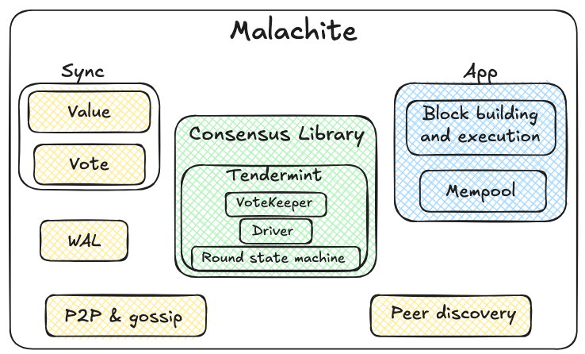

# Malachite Architecture

This document describes the high-level architecture of Malachite.
If you want to familiarize yourself with the codebase, you are in the right place!

If are already familiar with the architecture of decentralized systems, feel free to skip the Bird's Eye View, and proceed directly to [Malachite APIs and Design](#malachite-apis-and-design).

## Bird's Eye View

At the highest level, Malachite is a BFT consensus engine.
It enables developers to build decentralized, fault-tolerant applications.

To facilitate the building of decentralized applications, developers use Malachite as a collection of primitives, libraries, and recipes that they integrate into their application.
Besides Malachite, the application likely imports and integrates other libraries.
The following image sketches the mental model for understanding the abstract relationship between Malachite and the application. 


### Decentralized applications 101

In practice, applications built on top of Malachite will operate on a network comprising multiple peers.
Each peer runs its own instance of the application. Peers stay connected over the network, and
some peers may be faulty, for example, they may crash or send malformed messages.


The main challenge is for the application state across all peers to be consistent.
This is where Malachite comes into play.

#### Malachite concerns

As mentioned already, Malachite libraries, primitives, and recipes function as building blocks for application developers.
For example, the application might be a decentralized sequencer.
In this case, each peer of the application should produce the same sequence of blocks.
Alternatively, the application might be a decentralized social network.
The application state in such a case would require that all peers agree on which user accounts (i.e., social accounts) exist and what is the timeline of each account; to achieve this, the application would produce a totally ordered list of accounts and timelines, intuitively.  

The building blocks that Malachite offers take care of concerns such as follows:

- Ensure that all peers produce the same sequence of actions, e.g., sequencer blocks or user accounts
- In case a peer crashes, it can restart operating safely, resuming executing from a prior state
- In case a minority of peers are faulty, the network may still operate
- Ensure that no correct peer will never revert or alter a block that is finalized

#### Application concerns

As described above, by instantiating Malachite building blocks in their application, developers do not need to focus on concerns related to replication and fault-tolerance.
Instead, they focus on the strictly necessary, core part of what they are building.
Namely, that is the application logic, which typically entails problems such as:

- What to do with a new decision that the network of peers produced?
- What should a block consist of?
- Should the application execute actions before, during, or after the peers reach a decision?

The application developer may also be concerned about more advanced topics.
Malachite is flexible and amenable to an extensive range of customizations, for example:

- What kind of networking layer may be most appropriate for the application?
- Should the application handle the dissemination of user transactions using a mempool?
- What kind of signature schemes should be used?
- Should peers catch up with one another using an advanced protocol, or re-use the one that Malachite provides?

## Malachite Design

### Values and Votes

We use the term _value_ to denote a new value that is finalized.
For example, each value can be seen as a new block.
A _vote_ is one of the intermediary steps that peers take to reach a decision on a certain value.

These terms are inspired by the [article describing Tendermint consensus algorithm][tendermint-article].
Malachite is more general than Tendermint, however, and we aim to bundle additional consensus algorithms beyond this one.

### Components

Malachite comes initially bundled with the following components.



The core of Malachite is marked in green background and comprises three basic modules:

1. a Vote Keeper (for aggregating votes from peers and keeping track of quorums),
2. a Round State Machine (implementing the Tendermint algorithm logic within a round), and
3. a Driver (which operates the state machine across multiple rounds).

This consensus library makes no assumptions about the environment in which it runs or what kind of applications are built with it. It represents the most flexible consensus API in the world to the best of our knowledge.

Besides this core library, applications can use various other primitives that Malachite exports.
These include synchronization support enabling peers to catch up in terms of Votes or Values; a Write-Ahead-Log (WAL) to enable safe recovery from crashes; or a peer-to-peer networking layer based on libp2p, or a mempool subsystem.

### Consensus Library

### Building with the consensus library directly

By default, application developers may not want to build on top of the consensus library directly, and instead use higher-level primitives. 
We provide in [docs/tutorials](./docs/tutorials) and in [examples](./code/examples) ways to do so.
If you are still interested in understanding the core library, then please read on.

### Overview

The Malachite consensus library is pure, i.e., it does not perform any input/output nor result in side effects. 
The library is also stateless, i.e., it expects the caller to provide any state relevant as input to any call. 
This allows a high level of portability, enabling Malachite to be flexible to deployment in a very wide variety of environments or applications.
Given this design, the consensus library requires a Host, i.e., an environment in which it executes.
The term "Host" is interchangeable with "Application."

#### Consensus Library Architecture

This sketch shows the architecture of the consensus library.


The Malachite consensus library API consists of two sets of interfaces which the Host can use to run the library and build a meaningful application. Each interface is a set of messages. The first interface represents the set of input messages. The second one is the set of output messages. We call the former Inputs and the latter Effects.

At this highest level, the Host invokes Malachite with a certain Input message, and Malachite yields potentially an Effect to the Host.

In the current design, to simplify the management of the Host/Malachite interaction, we employ a macro as follows:

```rust
malachite_consensus::process!(
	input: input,
	state: &mut state.consensus,
	metrics: &self.metrics,
	with: effect => {
	    self.handle_effect(myself, &mut state.timers, &mut state.timeouts, effect).await
	}
)
```

The Host implements the `handle_effect` method and we can think of this as the top-level loop — or controller — of the application. Before we dive into this behavior in the Host, we’ll first describe in more detail the Inputs and Effects.

### What do Inputs and Effects look like?

We define the set of all the possible Inputs that the Malachite library supports as an `enum`.
The Inputs are defined in

https://github.com/informalsystems/malachite/blob/6f4cfce72fa0362d743320c0e3ea8fa46b4283b0/code/crates/core-consensus/src/input.rs#L13-L44

```rust
pub enum Input
{
    /// Start a new height with the given validator set
    StartHeight(Height, ValidatorSet),

    /// Process a vote
    Vote(SignedVote),

    /// Process a proposal
    Proposal(SignedProposal),

    /// Propose a value
    ProposeValue(Height, Round, Value, Option<Extension>),

    /// A timeout has elapsed
    TimeoutElapsed(Timeout),

    /// The value corresponding to a proposal has been received
    ReceivedProposedValue(ProposedValue),
}
```

Based on a simple reading of the above, it is not straightforward to see that Malachite implements the Tendermint consensus algorithm in Rust. We have not applied this interface to other consensus algorithms, so it is too early to say how general this part of the API is.

Our intuition tells us to follow an unorthodox path to generality, however. Instead of designing this API to cater to different underlying implementations (i.e., different consensus engines), we are validating the API against different expectations from the caller, i.e. the Host. If the API satisfies callers with wildly differing assumptions (Cosmos’ ABCI, Ethereum Reth, a plain KV store) then we validate it as general enough. Put differently, we believe it is the task of the consensus sub-system to mold itself to application requirements, not the other way around.

The `enum` that captures all the possible variations of an Effect is more verbose than the inputs:

```rust
pub enum Effect
{
    /// Reset all timeouts
    /// Resume with: [`Resume::Continue`]
    ResetTimeouts,

    /// Cancel all timeouts
    /// Resume with: [`Resume::Continue`]
    CancelAllTimeouts,

    /// Cancel a given timeout
    /// Resume with: [`Resume::Continue`]
    CancelTimeout(Timeout),

    /// Schedule a timeout
    /// Resume with: [`Resume::Continue`]
    ScheduleTimeout(Timeout),

    /// Consensus is starting a new round with the given proposer
    /// Resume with: [`Resume::Continue`]
    StartRound(Height, Round, Address),

    /// Broadcast a message
    /// Resume with: [`Resume::Continue`]
    Broadcast(SignedConsensusMsg),

    /// Get a value to propose at the given height and round, within the given timeout
    /// Resume with: [`Resume::Continue`]
    GetValue(Height, Round, Timeout),

    /// Get the validator set at the given height
    /// Resume with: [`Resume::ValidatorSet`]
    GetValidatorSet(Height),

    /// Verify a signature
    /// Resume with: [`Resume::SignatureValidity`]
    VerifySignature(SignedMessage<ConsensusMsg>, PublicKey),

    /// Consensus has decided on a value
    /// Resume with: [`Resume::Continue`]
    Decide {
        proposal: SignedProposal,
        commits: Vec<SignedMessage<Vote>>,
    },
}
```


## Going further

To explore further topics, we encourage reading [docs/tutorials](./docs/tutorials) and experimenting with the applications in [examples](./code/examples).


[tendermint-article]: https://arxiv.org/abs/1807.04938