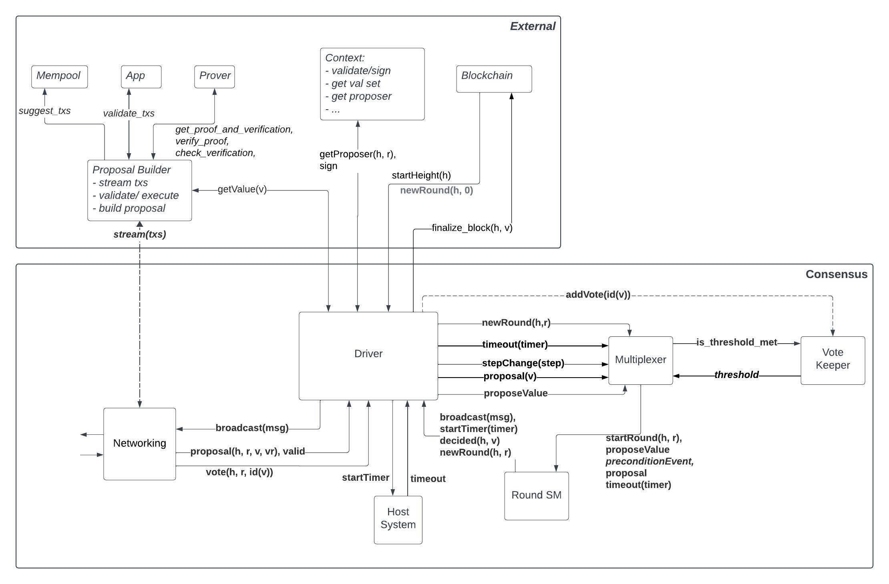

# ADR 001: High Level Architecture for Tendermint Consensus Implementation in Rust

## Changelog
* 2023-10-27: First draft.

## Context

This ADR provides architecture and design recommendations for the implementation of the Tendermint consensus protocol in Rust. The implementation follows the article ["The latest gossip on BFT consensus"](#References) and the English and Quint specifications located in the [Specs](../../Specs) directory.

### Terminology

We use terminology in line with [prior art on Tendermint and BFT consensus](https://docs.cometbft.com/v0.34/introduction/). To recall briefly:
- The consensus implementation reaches a decision on a _value_, which is the primary output. This is done repeatedly, such that the system proceeds in _heights_, and each height produces a new _value_.
- To reach decision on a value in a given height, multiple _rounds_ may be necessary. The algorithm starts from _round 0_.
- The implementation relies on exchanges of _proposals_ and _votes_. Each _round_ is associated with a specific _proposer_ which has the role of proposing a value to be decided upon.

## Decision

### Repository Overview

The repository is split in three areas, each covering one of the important areas of this project:
1. [Code](../../Code): Comprises the Rust implementation of the Tendermint consensus algorithm, split across multiple Rust crates.
2. [Docs](../../Docs): Comprises Architectural Decision Records (ADRs) such as the present file and other documentation.
3. [Specs](../../Specs): English and Quint specifications.

TODO: We should consider renaming Code into something else.
TODO: Consider using lower-case naming of the top-level folders, e.g., `specs` instead of `Specs`.
TODO: Do we need to describe the code layout and Rust crates, or is the description of the implementation below enough?

### Overview of the Tendermint Consensus Implementation 

The consensus implementation comprises three components:
- Consensus Driver
- Vote Keeper
- Round State Machine



The components of the consensus implementation as well as the associated abstractions are described in more detail below.

### Data Types & Abstractions

#### Context

The Tendermint consensus implementation will satisfy the `Context` interface, detailed below.
The data types used by the consensus algorithm are abstracted to allow for different implementations.

```rust
pub trait Context
where
    Self: Sized,
{
    type Address: Address;
    type Height: Height;
    type Proposal: Proposal<Self>;
    type Validator: Validator<Self>;
    type ValidatorSet: ValidatorSet<Self>;
    type Value: Value;
    type Vote: Vote<Self>;
    type SigningScheme: SigningScheme; // TODO: Do we need to support multiple signing schemes?

    /// Sign the given vote using the given private key.
    /// TODO: Maybe move this as concrete methods in `SignedVote`?
    fn sign_vote(vote: &Self::Vote, private_key: &PrivateKey<Self>) -> Signature<Self>;

    /// Verify the given vote's signature using the given public key.
    /// TODO: Maybe move this as concrete methods in `SignedVote`?
    fn verify_signed_vote(signed_vote: &SignedVote<Self>, public_key: &PublicKey<Self>) -> bool;

    /// Build a new proposal for the given value at the given height, round and POL round.
    fn new_proposal(
        height: Self::Height,
        round: Round,
        value: Self::Value,
        pol_round: Round,
    ) -> Self::Proposal;

    /// Build a new prevote vote by the validator with the given address,
    /// for the value identified by the given value id, at the given round.
    fn new_prevote(round: Round, value_id: Option<ValueId<Self>>) -> Self::Vote;

    /// Build a new precommit vote by the validator with the given address,
    /// for the value identified by the given value id, at the given round.
    fn new_precommit(round: Round, value_id: Option<ValueId<Self>>) -> Self::Vote;
}
```

Note:
- TBD: we should figure out where to put `broadcast_message(), start_timer()`
    - @romac: Likely outside of the `Driver`, so left up to the runtime which drives the driver.


#### Consensus Driver

##### Data Structures

The Consensus Driver is concerned with running the consensus algorithm for a single height, ie. it drives the state machine across multiple rounds.

It is therefore initialized with the height once and the instance is destroyed once a value for that height has been decided. Other parameters are required during initialization and operation as described below.

```rust
pub struct Driver<Ctx>
where
    Ctx: Context
{
    ctx: Ctx
    env: Env<Ctx>,
    height: Ctx::Height,
    address: Ctx::Address,
    validator_set: Ctx::ValidatorSet,
    round: Round, // Current round, initialized with None
    votes: VoteKeeper<Ctx>,
    round_states: BTreeMap<Round, RoundState<Ctx>>,
}

```
Note:
- TBD: Multiple rounds are currently maintained, and it is still under discussion if this is necessary.

##### Input Events (External APIs)

The Consensus Driver receives events from the peer-to-peer layer and other external modules it interacts with. 

```rust
pub enum Event<C>
where
    C: Context
{
    StartRound(Round),            // Start a new round
    Proposal(C::Proposal, Valid), // A proposal has been received, must be complete
    Vote(SignedVote<C>),          // A vote has been received
    TimeoutElapsed(Timeout),      // A timeout has elapsed
}

```
Notes:
- Round `0` is always started by an external module. Subsequent rounds are started by the driver when the Round State Machine indicates it via the `NewRound` message.
- A proposal event must include a proposal and a `valid` flag indicating if the proposal is valid. The proposal must be complete, i.e. it must contain a complete value or an identifier of the value (`id(v)`). If the value is sent by the proposer in multiple parts, it is the responsibility of the consensus environment to collect and verify all the parts and the proposal message in order to create a complete proposal and the validity flag.
- `Vote` can be a `Prevote` or `Precommit` vote.
- The driver interacts with the host system to start timers and expects to receive timeout events for the timers that it started and have fired. The timeouts can be:
```
    Propose,
    Prevote,
    Precommit,
```

##### Operation

The Driver sends votes to the Vote Keeper module. The Driver expects that whenever the Keeper observes any threshold of votes for the first time it returns that to the Driver.

Based on its state and the results received from the Vote Keeper, the Driver sends events to the Round State Machine which, once it processes the Driver events, returns consensus-related messages back to the Driver. The Driver then processes these messages and sends them to the consensus environment, the host system, or in some cases processes them internally (e.g. `NewRound(round)` message).

Notes:
- Proposals and vote messages must be signed by the sender and validated by the receiver. Signer must be the proposer for `Proposal` and a validator for `Vote`.
  - TBD: Should the driver perform any signature verification of the messages it receives from the consensus environment (see `verify_signed_vote()` in `Context` trait? Or are we assuming that the consensus environment performs this validation?
- On `StartRound(round)` event, the Driver must determine if it is the proposer for the given round. For this it needs access to a `validator_set.get_proposer(round)` method or similar.
- TBD: When skipping to a new round, it may be beneficial to mutate the validator set such that the proposer for the new round is different from the proposer of the previous round, i.e. access to `validator_set.update_proposer()` method (or similar) may be required.
- When building a proposal the driver will use the `get_value()` method of the environment context to retrieve the value to propose. It will block until a value is available or a (propose) timeout occurs.
  - It is TBD which Rust constructs will be used to implement this behavior.
  - TBD how the Round SM could start the propose timer if we block on `get_value()` in the driver.

##### Output Messages (External Dependencies)

```rust
pub enum Message<C>
where
    C: Consensus,
{
    Propose(C::Proposal),      // Request to broadcast a proposal to peers
    Vote(SignedVote<C>),       // Request to broadcast a vote to peers
    Decide(Round, C::Value),   // Signal that a decision has been reached
    ScheduleTimeout(Timeout),  // Request the host system to start a timer
}
```
Notes:
- Should the driver sign the messages before sending them to the consensus context (see `sign_vote()` in `Context` trait)? Or are we assuming that the consensus environment does this?
  - @romac: See simlar note below in the "Driver Context" section.

### Driver Context

The driver is passed a instance of the `Context` trait which defines all the data types used by this instance of the consensus engine,
and also provides synchronous, stateless methods for creating and signing votes.

Notes:
- Should these methods rather live in the driver environment, ie. in the `Env` trait?
  For example, signing can require I/O and/or asynchrony, eg. in the case where one use a hardware keypair.

### Driver Environment

The driver can make use of an environment to get a value to propose.
This environment is defined as an async interface to be implemented by the code downstream of the `Driver`.

```rust
#[async_trait]
pub trait Env<Ctx>
where
    Ctx: Context,
{
    /// Get the value to propose.
    async fn get_value(&self) -> Ctx::Value;
}
```

Notes:
- Should we build in the notion of fallability and timeouts for assembling a value?
  ie. change the signature of `get_value` to `async fn get_value(&self) -> Result<Ctx::Value, Error>`,
  for some error type `Error` that can model timeouts and failures.

#### Vote Keeper

##### Data Structures

The Vote Keeper is concerned with keeping track of the votes received and the thresholds of votes observed for each round.
To this end, it maintains some state per each round:

```rust
struct PerRound<Ctx>
where
    Ctx: Context,
{
    votes: RoundVotes<Ctx::Address, ValueId<Ctx>>,
    addresses_weights: RoundWeights<Ctx::Address>,
    emitted_msgs: BTreeSet<Message<ValueId<Ctx>>>,
}
```

```rust
pub struct VoteKeeper<C>
where
    C: Context,
{
    height: C::Height,
    validator_set: C::ValidatorSet,
    quorum_threshold: ThresholdParameter,
    honest_threshold: ThresholdParameter,
    total_weight: Weight,
    per_round: BTreeMap<Round, PerRound<C>>,
}
```

- The quorum and minimum correct validator thresholds are passed in as parameters during initialization. These are used for the different threshold calculations.
- The `validator_set` is used to detect equivocation; also to ensure that prevote and precommit messages from the same validator are not counted twice for the same round, e.g. in the case of the `honest_threshold` case (`f+1` in L55 in the BFT paper) for prevotes and precommits.

##### Input Events (Internal APIs)

The Vote Keeper receives votes from the Consensus Driver via:

```rust
pub fn apply_vote(&mut self, vote: C::Vote, weight: Weight) -> Option<Message<ValueId<C>>>
```

##### Operation

The Vote Keeper keeps track of the votes received for each round and the total weight of the votes. It returns any thresholds seen **for the first time**.

##### Output Messages

The Driver receives these output messages from the Vote Keeper.

```rust
pub enum Message<C>
where 
    C: Context
{
    PolkaAny,                               // Received quorum prevotes for anything. L34
    PolkaNil,                               // Received quorum prevotes for nil. L44
    PolkaValue(ValueId<C>),                 // Received quorum prevotes for Value. L44
    PrecommitAny,                           // Received quorum precommits for anything. L47
    PrecommitValue(ValueId<C>),             // Received quorum precommits for Value. L51
    ThresholdCorrectProcessInHigherRound,   // Received messages from minimum of honest validators and for a higher round (as defined by honest_threshold). See L55
}
```

#### Round State Machine

##### Data Structures

The Consensus State Machine is concerned with the internal state of the consensus algorithm for a given round. It is initialized with the height and round. When moving to a new round, the driver creates a new round state machine and may or may not destroy the other round SMs.

```rust
pub struct State<C>
where 
    C: Context
{
    pub height: C::Height,
    pub round: Round,
    pub step: Step,
    pub proposal: Option<C::Proposal>,
    pub locked: Option<RoundValue<C::Value>>,
    pub valid: Option<RoundValue<C::Value>>,
}
```

##### Input Events (Internal APIs)

The Round state machine receives events from the Consensus Driver via:

```rust
pub fn apply_event<C>(mut state: State<C>, round: Round, event: Event<C>) -> Transition<C>
where
    C: Context
```

The events passed to the Round state machine are very close to the preconditions for the transition functions in the BFT paper, i.e., the `upon` clauses.
In addition:
- The `StartRound` events specify if the SM runs in the proposer mode or not. In the former case, the driver also passes a valid value to the round SM.
- There are two `Poposal` events, for valid and invalid values respectively. Therefore, the `valid(v)` check is not performed in the round SM but by the Driver

```rust
pub enum Event<C> 
where 
    C: Context
{
    StartRound,                           // Start a new round, not as proposer.L20
    StartRoundProposer(C::Value),         // Start a new round and propose the Value.L14
    Proposal(C::Proposal),                // Received a proposal. L22 + L23 (valid)
    ProposalAndPolkaPrevious(C::Value),   // Received a proposal and a polka value from a previous round. L28 + L29 (valid)
    ProposalInvalid,                      // Received an invalid proposal. L26 + L32 (invalid)
    PolkaValue(ValueId<C>),               // Received quorum prevotes for valueId. L44
    PolkaAny,                             // Received quorum prevotes for anything. L34
    PolkaNil,                             // Received quorum prevotes for nil. L44
    ProposalAndPolkaCurrent(C::Value),    // Received quorum prevotes for Value in current round. L36
    PrecommitAny,                         // Received quorum precommits for anything. L47
    ProposalAndPrecommitValue(C::Value),  // Received quorum precommits for Value. L49
    PrecommitValue(ValueId<C>),           // Received quorum precommits for ValueId. L51
    ThresholdCorrectProcessInHigherRound, // Received messages from a number of honest processes in a higher round. aka RoundSkip, L55
    TimeoutPropose,                       // Timeout waiting for proposal. L57
    TimeoutPrevote,                       // Timeout waiting for prevotes. L61
    TimeoutPrecommit,                     // Timeout waiting for precommits. L65
}
```

##### Operation

The Round State Machine keeps track of the internal state of consensus for a given round. It resembles very closely the algorithm description in the [original "The Latest gossip on BFT consensus" paper](#References).

##### Output Messages

The Round state machine returns the following messages to the Driver:

```rust
pub enum Message<C>
where 
    C: Context
{
    NewRound(Round),                // Move to a new round, could be next or skipped round.
    Proposal(C::Proposal),          // Broadcast a proposal.
    Vote(C::Vote),                  // Broadcast a vote.
    Timeout(Timeout),               // Schedule a timeout.
    Decision(RoundValue<C::Value>), // Decided on a value.
}
```

## Status

Accepted

## Consequences

### Positive

- The abstraction offered by `enum Event` encapsulates all the complexity of `upon` clauses, it simplifies reasoning about the pure state machine logic within the Round State Machine.
- The semantics of counting votes and reasoning about thresholds is grouped into the Vote Keeper module and clearly separates that concern from the state machine logic.
- Functionality is offloaded to the host system wherever possible: The concerns of scheduling, managing, and firing timeouts.
- All sources of non-determinism have been excluded outside the boundaries of the consensus implementation, e.g. `valid` method, timeouts, I/O triggers, thus simplifying testing and reasoning about this system. 
- TODO: Events vs. Messages positive consequences.

### Negative

- The `enum Event` has numerous variants and comprises many nuances, thus may be difficult to understand.

### Neutral

- The concept of `Vote` is borrowed from earlier implementations of Tendermint consensus algorithm and this may be at times ambiguous.
- The concept of `Height` is borrowed from ["The latest gossip.."](#references) article and it may be inaccurate in some contexts. For example, a height is a straightforward concept in the context of implementing a blockchain system, but it may be inappropriate in the implementation of general-purpose sequencing systems, total-order logs, or atomic broadcast.  

## References

* [CometBFT v0.34 docs](https://docs.cometbft.com/v0.34/introduction/)
* ["The latest gossip on BFT consensus"](https://arxiv.org/pdf/1807.04938.pdf), by _Buchman, Kwon, Milosevic_. 2018.
