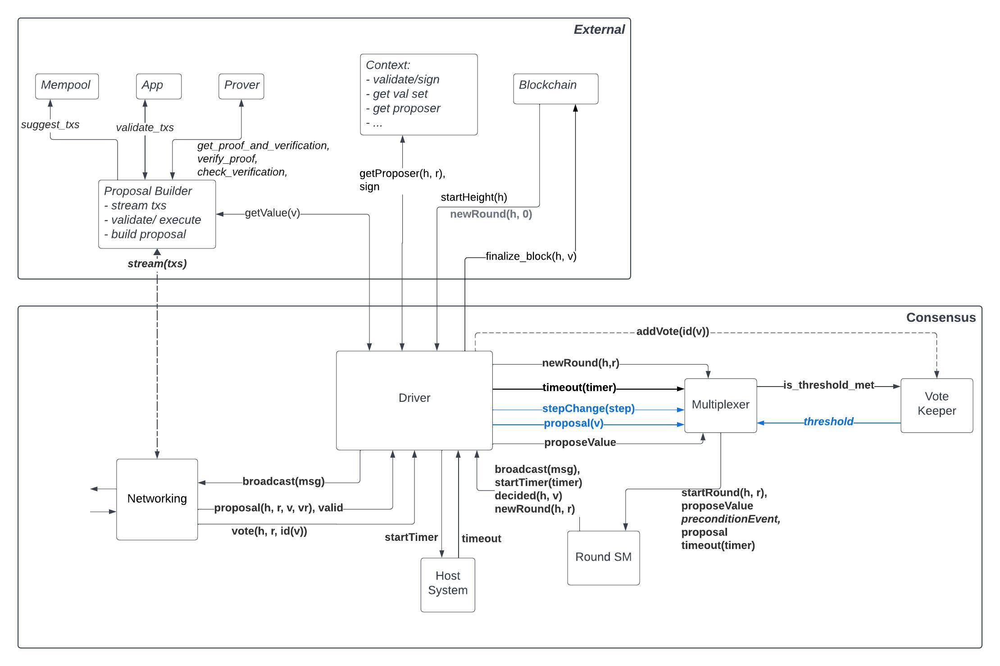

# ADR 001: High Level Architecture and Design for the BFT Tendermint Consensus Algorithm in Rust

## Changelog
* 2023-10-27: First draft.

## Context

This ADR provides architecture and design recommendations for the implementation of the tendermint consensus protocol in Rust. It is based on the latest [BFT consensus paper](https://arxiv.org/pdf/1807.04938.pdf), the english and quint specifications located in the Specs directory(todo - provide links).

## Decision

The system is composed of the following components:
- Consensus Executor
- Vote Keeper
- Round State Machine

.

These are described in the following sections.

### Data Type Abstractions
_Tentative_
The following data types are used in the consensus algorithm and are abstracted out to allow for different implementations:

```rust
pub trait Consensus
where
    Self: Sized,
{
    type Address: Address;
    type Height: Height;
    type Proposal: Proposal<Self>;
    type Validator: Validator<Self>;
    type ValidatorSet: ValidatorSet<Self>;
    type Value: Value;
    type Vote: Vote<Self>;
    type SigningScheme: SigningScheme; // TODO: Do we need to support multiple signing schemes?

    /// Sign the given vote using the given private key.
    /// TODO: Maybe move this as concrete methods in `SignedVote`?
    fn sign_vote(vote: &Self::Vote, private_key: &PrivateKey<Self>) -> Signature<Self>;

    /// Verify the given vote's signature using the given public key.
    /// TODO: Maybe move this as concrete methods in `SignedVote`?
    fn verify_signed_vote(signed_vote: &SignedVote<Self>, public_key: &PublicKey<Self>) -> bool;

    /// Build a new proposal for the given value at the given height, round and POL round.
    fn new_proposal(
        height: Self::Height,
        round: Round,
        value: Self::Value,
        pol_round: Round,
    ) -> Self::Proposal;

    /// Build a new prevote vote by the validator with the given address,
    /// for the value identified by the given value id, at the given round.
    fn new_prevote(round: Round, value_id: Option<ValueId<Self>>) -> Self::Vote;

    /// Build a new precommit vote by the validator with the given address,
    /// for the value identified by the given value id, at the given round.
    fn new_precommit(round: Round, value_id: Option<ValueId<Self>>) -> Self::Vote;
}
```
Note:
- we should figure out where to put the `get_value(), broadcast_message(), start_timer()` 


### Consensus Executor
#### Data Structures
The Consensus Executor is concerned with running the consensus algorithm for a single height. It is therefore initialized with the height once and the instance is destroyed once a value for that height has been decided. Other parameters are required during initialization and operation as described below.
```rust
pub struct Executor<C>
where
    C: Consensus,
{
    height: C::Height,
    key: Secret<PrivateKey<C>>,
    validator_set: C::ValidatorSet,
    round: Round, // Current round, initialized with None
    votes: VoteKeeper<C>,
    round_states: BTreeMap<Round, RoundState<C>>,
}

```
Note: Multiple rounds are maintained, and it is still under discussion if this is necessary.

#### Input Events (APIs)
The Consensus Executor receives events from the peer-to-peer layer and other external modules it interacts with. 
```rust
pub enum Events<C>
where
    C: Consensus,
{
    NewRound(Round), // Start a new round, currently must be 0
    Proposal(C::Proposal), // A proposal has been received, must be complete
    Vote(SignedVote<C>), // A vote has been received
    Timeout(Timeout), // A timeout has occurred
}

```
Notes:
- Round 0 is always started by an external module. Subsequent rounds are managed by the executor.
- The proposal must be complete, i.e. it must contain a complete value. If this value is sent by the proposer in chunks, it is the responsibility of the chain concrete implementation collect the proposal for the value ID and the chunks to create a complete proposal.
- The proposal should also implement `valid(v)`.
- `Vote` can be a prevote or precommit vote. 
- The executor interacts with the host system to start timers and expects to receive timeout events for the timers that it started and have fired. The timeouts can be:
```
    Propose,
    Prevote,
    Precommit,
```

#### Operation
Votes are sent to the Vote keeper module that returns any thresholds seen for the first time. 

Based on its state and the messages received from the Vote keeper, the executor sends events to the Consensus State Machine which, once it processes the executor events, returns consensus related messages back to the executor. The executor then processes these messages and sends them to the peer-to-peer layer or the host system.

#### Output Messages (External Dependencies)
```rust
pub enum Output<C>
where
    C: Consensus,
{
    Propose(C::Proposal), // Broadcast a proposal to peers
    Vote(SignedVote<C>), // Broadcast a vote to peers
    Decide(Round, C::Value), // Signal to the host system that a decision has been reached
    SetTimeout(Timeout), // Request the host system to start a timer
}
```

### Vote Keeper
#### Data Structures
The Vote Keeper is concerned with keeping track of the votes received and the thresholds seen for each round. It is initialized with the validator set and the height. It is destroyed once a decision has been reached for the height.

```rust
pub struct VoteKeeper<C>
where
    C: Consensus,
{
    height: C::Height,
    total_weight: Weight,
    rounds: BTreeMap<Round, RoundVotes<C>>,
}
```
Note: The above is a first draft and is likely to change:
- the quorum and minimum correct validator thresholds must be passed in as parameters during initialization. These are used for the different threshold calculations.
- validator_set is not included but it is needed so the vote keeper detects equivocation; also to ensure that prevote and precommit messages from the same validator are not counted twice for the same round, e.g. in the case of `f+1` threshold for prevotes and precommits.
- may require future changes if the keeper also handles proposal messages (TBD)

#### Input Events (Internal APIs)
The Vote Keeper receives votes from the Consensus Executor via:

```rust
pub fn apply_vote(&mut self, vote: C::Vote, weight: Weight) -> Option<Message<C>>
```

#### Operation
The Vote Keeper keeps track of the votes received for each round and the total weight of the votes. It returns any thresholds seen **for the first time**.

#### Output Messages for the Executor

```rust
pub enum Event<C: Consensus> {
    PolkaAny, // Receive +2/3 prevotes for anything. L34
    PolkaNil, // Receive +2/3 prevotes for nil. L44
    PolkaValue(ValueId<C>), // Receive +2/3 prevotes for Value. L44
    PrecommitAny, // Receive +2/3 precommits for anything. L47
    PrecommitValue(ValueId<C>), // Receive +2/3 precommits for Value. L51
    ThresholdCorrectProcessInHigherRound, // Receive +1/3 messages from a higher round. See L55
}
```
TODO - fix line numbers (more are needed)

### Round State Machine
#### Data Structures
The Consensus State Machine is concerned with the internal state of the consensus algorithm for a given round. It is initialized with the height and round. When moving to a new round the executor creates a new round state machine and may or may not destroy the other round FSMs.

```rust
pub struct State<C: Consensus> {
    pub height: C::Height,
    pub round: Round,
    pub step: Step,
    pub proposal: Option<C::Proposal>,
    pub locked: Option<RoundValue<C::Value>>,
    pub valid: Option<RoundValue<C::Value>>,
}
```

#### Input Events (Internal APIs)
The Round state machine receives events from the Consensus Executor via:
```rust
pub fn apply_event<C>(mut state: State<C>, round: Round, event: Event<C>) -> Transition<C>
where
    C: Consensus,
{}
```

The events passed to the Round state machine are very close to the preconditions for the transition functions in the BFT paper. 
In addition:
- the `NewRound` events specify if the SM runs in the proposer mode or not. In the former case a value is also passed to the SM from the executor.
- there are two `Poposal` events, for valid and invalid values. Therefore the `valid(v)` check is not performed in the SM but externally by the executor (tbd who exactly does that)

```rust
pub enum Event<C: Consensus> {
    NewRound,                   // Start a new round, not as proposer.L20
    NewRoundProposer(C::Value), // Start a new round and propose the Value.L14
    Proposal(C::Proposal),      // Receive a proposal. L22 + L23 (valid)
    ProposalAndPolkaPrevious(C::Value), // Recieved a proposal and a polka value from a previous round. L28 + L29 (valid)
    ProposalInvalid,         // Receive an invalid proposal. L26 + L32 (invalid)
    PolkaValue(ValueId<C>),  // Receive +2/3 prevotes for valueId. L44
    PolkaAny,                // Receive +2/3 prevotes for anything. L34
    PolkaNil,                // Receive +2/3 prevotes for nil. L44
    ProposalAndPolkaCurrent(C::Value),     // Receive +2/3 prevotes for Value in current round. L36
    PrecommitAny,            // Receive +2/3 precommits for anything. L47
    ProposalAndPrecommitValue(C::Value), // Receive +2/3 precommits for Value. L49
    PrecommitValue(ValueId<C>), // Receive +2/3 precommits for ValueId. L51
    ThresholdCorrectProcessInHigherRound, // Receive +1/3 messages from a higher round. aka RoundSkip, L55
    TimeoutPropose,          // Timeout waiting for proposal. L57
    TimeoutPrevote,          // Timeout waiting for prevotes. L61
    TimeoutPrecommit,        // Timeout waiting for precommits. L65
}
```

#### Operation
The Round state machine keeps track of the internal state of the consensus algorithm for a given round. It should be very close to the algorithm description in the original BFT consensus paper. 

#### Output Messages
The Round state machine returns the following messages to the executor:

```rust
pub enum Message<C>
where
    C: Consensus,
{
    NewRound(Round),                // Move to the new round.
    Proposal(C::Proposal),          // Broadcast the proposal.
    Vote(C::Vote),                  // Broadcast the vote.
    Timeout(Timeout),               // Schedule the timeout.
    Decision(RoundValue<C::Value>), // Decide the value.
}
```

## Status

> A decision may be "proposed" if it hasn't been agreed upon yet, or "accepted" once it is agreed upon. If a later ADR changes or reverses a decision, it may be marked as "deprecated" or "superseded" with a reference to its replacement.

{Deprecated|Proposed|Accepted}

## Consequences

> This section describes the consequences, after applying the decision. All consequences should be summarized here, not just the "positive" ones.

### Positive

### Negative

### Neutral

## References

> Are there any relevant PR comments, issues that led up to this, or articles referrenced for why we made the given design choice? If so link them here!

* {reference link}
