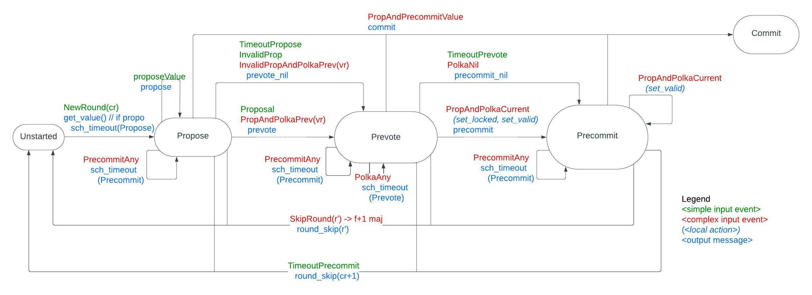

# Consensus protocol: round state machine

This document provides an overview of the Tendermint consensus protocol and follows ["The latest gossip on BFT consensus"](#References) and the English and Quint specifications located in the [Specs](../../Specs) directory.

The consensus state-machine operates on complex `Event`s that reflect the
reception of one or multiple `Message`s, combined with state elements and the
interaction with other modules.

## Round state-machine

The state machine represents the operation of consensus at a single `Height(h)` and `Round(r)`.

The set of states can be summarized as:

- `NewRound`
  - Initial state
  - Can be used to store messages early received for this round
  - In the algorithm when `roundp < r`, where `roundp` is the node's current round
- InProgress (`Propose`, `Prevote`, `Precommit`)
  - Actual consensus single-round execution
  - In the algorithm when `roundp == r`
- `Commit`
  - Final state for a successful round

### Exit transitions
The table below summarizes the major state transitions in the `Round(r)` state machine.
The transactions from state `InProgress` consider that node can be at any of
the `Propose`, `Prevote`, `Precommit` states.
The `Ref` column refers to the line of the pseudocode where the events can be found.

| From       | To         | Ev Name                      | Event  Details                                                      | Action                    | Ref |
| ------------ |------------|------------------------------| --------------------------------------------------------------------- | --------------------------- | ----- |
| InProgress | InProgress | PrecommitAny                 | `2f + 1 ⟨PRECOMMIT, h, r, *⟩`   for the first time             | schedule `TimeoutPrecommit(h, r)` | L47 |
| InProgress | NewRound   | TimeoutPrecommit             | `TimeoutPrecommit(h, r)`                                            | `next_round(r+1)`         | L65 |
| InProgress | NewRound   | SkipRound(r')                | `f + 1 ⟨*, h, r', *, *⟩` with `r' > r`                      | `next_round(r')`          | L55 |
| InProgress | Commit     | ProposalAndPrecommitValue(v) | `⟨PROPOSAL, h, r, v, *⟩`   `2f + 1 ⟨PRECOMMIT, h, r, id(v)⟩` | `commit(v)`               | L49 |

### InProgress round

The table below summarizes the state transitions within the `InProgress` state
of the `Round(r)` state machine.
The following state transitions represent the core of the consensus algorithm.
The `Ref` column refers to the line of the pseudocode where the events can be found.

| From      | To        | Event                                  | Details                                                                                | Actions and Return                                                                                    | Ref |
|-----------|-----------|----------------------------------------|----------------------------------------------------------------------------------------|-------------------------------------------------------------------------------------------------------|-----|
| NewRound | Propose   | NewRound(proposer)                     | `StartRound` with `proposer(h, r) = p` and `v = getValue()`                            | broadcast `⟨PROPOSAL, h, r, v, validRound⟩`                                                           | L19 |
| NewRound | Propose   | NewRound(non-proposer)                 | `StartRound` with `proposer(h, r) != p` (optional restriction)                              | schedule `TimeoutPropose(h, r)`                                                                       | L21 |
| Propose   | Prevote   | Proposal(v, -1)                        | `⟨PROPOSAL, h, r, v, −1⟩`                                                              | broadcast `⟨PREVOTE, h, r, {id(v), nil}⟩`                                                             | L23 |
| Propose   | Prevote   | InvalidProposal(v, -1)                 | `⟨PROPOSAL, h, r, v, −1⟩`                                                              | broadcast `⟨PREVOTE, h, r, nil⟩`                                                             | L32 |
| Propose   | Prevote   | ProposalAndPolkaPrevious(v, vr)        | `⟨PROPOSAL, h, r, v, vr⟩`   `2f + 1 ⟨PREVOTE, h, vr, id(v)⟩` with `vr < r`          | broadcast `⟨PREVOTE, h, r, {id(v), nil}⟩`                                                             | L30 |
| Propose   | Prevote   | InvalidProposalAndPolkaPrevious(v, vr) | `⟨PROPOSAL, h, r, v, vr⟩`   `2f + 1 ⟨PREVOTE, h, vr, id(v)⟩` with `vr < r`          | broadcast `⟨PREVOTE, h, r, nil⟩`                                                                      | L32 |
| Propose   | Prevote   | TimeoutPropose                         | `TimeoutPropose(h, r)`                                                                 | broadcast `⟨PREVOTE, h, r, nil⟩`                                                                      | L57 |
| Prevote   | Prevote   | PolkaAny                               | `2f + 1 ⟨PREVOTE, h, r, *⟩`   for the first time                                    | schedule `TimeoutPrevote(h, r)⟩`                                                                      | L34 |
| Prevote   | Precommit | ProposalAndPolkaCurrent(v)             | `⟨PROPOSAL, h, r, v, ∗⟩`   `2f + 1 ⟨PREVOTE, h, r, id(v)⟩`   for the first time  | update `lockedValue, lockedRound, validValue, validRound`,  broadcast `⟨PRECOMMIT, h, r, id(v)⟩` | L36 |
| Prevote   | Precommit | PolkaNil                               | `2f + 1 ⟨PREVOTE, h, r, nil⟩`                                                          | broadcast `⟨PRECOMMIT, h, r, nil⟩`                                                                    | L44 |
| Prevote   | Precommit | TimeoutPrevote                         | `TimeoutPrevote(h, r)`                                                                 | broadcast `⟨PRECOMMIT, h, r, nil⟩`                                                                    | L61 |
| Precommit | Precommit | PolkaValue(v)                          | `⟨PROPOSAL, h, r, v, ∗⟩`    `2f + 1 ⟨PREVOTE, h, r, id(v)⟩`   for the first time | update `validValue, validRound`                                                                       | L36 |

The ordinary operation of a round of consensus consists on the sequence of
round steps `Propose`, `Prevote`, and `Precommit`, represented in the table.
The conditions for concluding a round of consensus, therefore for leaving the
`InProgress` state, are presented in the next subsection.

All the state transitions represented in the table consider message and
events referring to the node's current round `r`.
In the pseudocode this current round of a node is referred as `round_p`.

There is, however, an exception: the transition `L28` requires the node to have
access to `PREVOTE` messages from a previous round `r' < r`.
This transition constitutes an exception that have to be handled in a proper way.

## References

* ["The latest gossip on BFT consensus"](https://arxiv.org/pdf/1807.04938.pdf), by _Buchman, Kwon, Milosevic_. 2018.