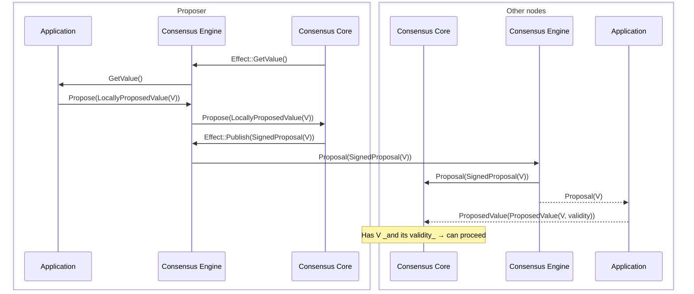
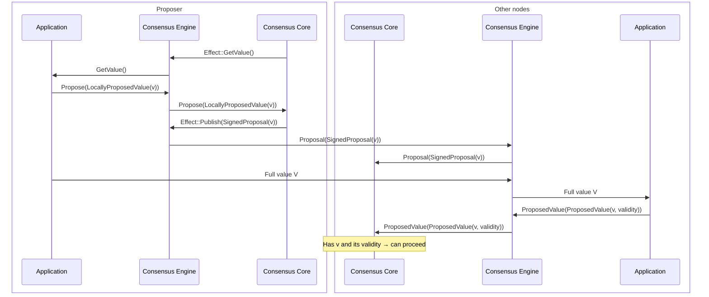
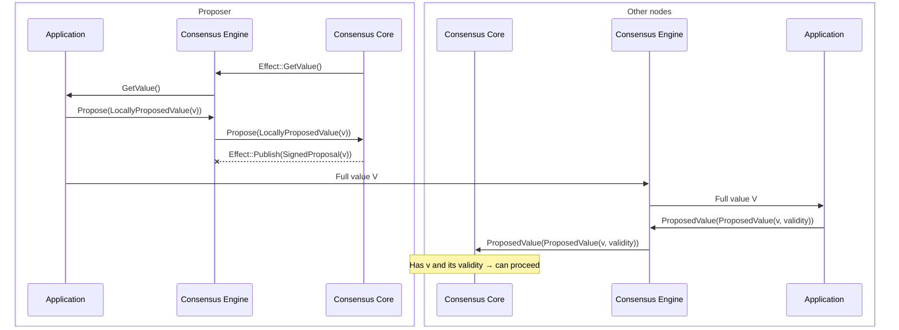

# ADR 003: Propagation of Proposed Values

## Changelog

* 2025-03-18: Context and description of the problem
* 2025-03-21: Current design description

## Context

Malachite implements a consensus algorithm, [Tendermint][consensus-spec], 
which allow processes to agree on a single decided value for each 
consensus instance or *height*. 

Possible decision values are provided by the software that uses the consensus, 
which we refer to generically as the *application*. There are 
no assumptions about what a **value** represents—its semantics are defined 
entirely by the application. For example, in blockchain applications, input 
values are blocks proposed to be appended to the blockchain.

Similarly, the consensus algorithm makes no assumptions about the **size** 
of the proposed values; they may be of arbitrary byte size. However, 
the application is expected to define a maximum size for proposed values 
and to configure the consensus parameters accordingly—most notably, 
the durations of timeouts.

When value size becomes a relevant factor, it is important to recognize 
that the consensus process comprises two distinct stages:

- **Value Propagation**: Proposed values must be transmitted to all consensus participants.
- **Value Decision**: One of the successfully propagated values is selected and decided.

The cost of **Value Propagation**, in terms of latency and bandwidth, 
clearly depends on the size of the proposed values. In contrast, the 
**Value Decision** stage should be independent of value size and 
incur a roughly constant cost.

In Tendermint, **Value Propagation** is performed via the `PROPOSAL` 
message, which is broadcast by the designated proposer of the round 
and includes the proposed value `v`.

The **Value Decision** phase involves `PREVOTE` and `PRECOMMIT` 
messages—collectively referred to as *votes*. Each vote includes 
either an identifier `id(v)` of the proposed value `v` or the 
special value `nil`. The function `id(v)` provides a compact 
representation of `v`, typically implemented as a fixed-size hash.

From this, we can see that **Value Propagation** is more challenging, 
as it involves disseminating potentially large amounts of data through 
the network. In contrast, the **Value Decision** phase requires only 
the transmission of vote messages, which are relatively small and of 
constant size. As a result, Malachite’s low-level API provides greater 
flexibility in the value propagation stage to enable more optimized 
implementations. 

In this document, we focus on the core parts of the consensus 
implementation responsible for **Value Propagation**.

Note: Not sure where to mention this but seems relevant. There have been some slight changes to the Tendermint consensus:
- `getValue()` is asynchronous and the propose timeout is passed as a parameter in order to let the builder know how long it has to build a value.
- `valid(v)` is checked when a `PROPOSAL` is available but before the algorithm runs. This is equivalent in a way with `PROPOSAL(h, r, v, vr, valid)` where valid = {Valid | Invalid}.

## Current design

### Building Blocks
_(WIP)_

There are a number of entities that are involved in the value propagation process.
- Application - this is the software that uses the consensus. It is responsible for:
  - providing the value to be propagated
  - validating received values
  - providing data availability for values (both undecided and decided)
- Consensus Engine - a component that is responsible for managing the interactions between the consensus core and the application, and between the consensus core and the networking layer. For the ones involved in the value propagation process, the consensus engine is responsible for:
  - propagating values and/or proposals via the networking layer
  - receiving values and/or proposals from the networking layer
  - relaying values and/or proposals to the consensus core
- Consensus Core - this is the component that implements the tendermint consensus protocol.
- Networking - this is the component that is responsible for transmitting messages between nodes.
(Currently not shown in the diagrams)

Malachite provides implementations for the consensus core, engine and networking. Applications can integrate with:

- consensus core - see [ADR-004](./adr-004-coroutine-effect-system.md)
- engine and core integration - farcaster?
- engine, core, networking integration - channel and starknet test examples?

### Value Payload Modes

At the moment, Malachite consensus implementation is supporting three
different modes of operation to handle value propagation: 
1) **ProposalOnly**
2) **PartsOnly**
3) **ProposalAndParts**

A specific mode can be set as a `value_payload` consensus parameter:

```rust
/// Consensus parameters.
#[derive_where(Clone, Debug)]
pub struct Params<Ctx: Context> {
   ...

    /// The messages required to deliver proposals
    pub value_payload: ValuePayload,

    ...
}

```


In the following, we examine each approach to understand how the consensus 
interacts with the environment, depending on the mode of operation adopted. 
Specifically, we focus on the core consensus inputs related to value propagation.
In general consensus inputs are how the consensus reacts to the events from 
the environment. A complete overview of all inputs processes by the consensus 
can be found in [ADR-004 Coroutine-Based Effect System for Consensus](./adr-004-coroutine-effect-system.md).


| **Input** | **Fields** | **Description** |
|-----------|------------|-----------------|
| `Proposal (SignedProposal<Ctx>)` | `height`, `round`, `value`, `value_origin` | This input is generated and passed to the consensus when a proposal consensus message is received from the network. |
| `Propose (LocallyProposedValue<Ctx>)` | `height`, `round`, `value` | This input is produced by the application in response to a consensus request (`getValue()`) for a value to propose. |
| `ProposedValue (ProposedValue<Ctx>, ValueOrigin)` | `height`, `round`, `valid_round`, `proposer`, `value`, `validity` | This input is also generated by the application when the application is responsible for disseminating values through the network. It informs the consensus that a proposedvalue has been received and validated. |


When processing each of these inputs, the consensus core may produce various effects that must be handled by the "environment" to fully process the input. All the effects produced by the consensus core are described in more detail in [ADR-004](./adr-004-coroutine-effect-system.md). These are especially relevant if the application integrates directly with the consensus core. Malachite offers a "Consensus Engine" crate that can be used as an integration point. Regardless the of the type of integration, the "Consensus Engine" is shown in this document as the part of the "environment" that handles the effects, relays messages between consensus core and the application, etc.

Here, our focus is limited to interactions related to value propagation and how they 
differ depending on the selected mode of operation. Towards this goal, in the following sections, the `height` , `round`, `valid_round`, and `value_origin` fields are omitted from the inputs.

### Possible value types for Consensus Core?

The concrete value type is defined by the context `Ctx` and is passed to consensus as a type parameter. Each application using the consensus will define its own concrete value type.
The value type must implement the `Value` trait, including the `id()` method. Consensus core uses the `id()` when generating the votes.

The following notations are used in the following sections:
- `V` denotes the full application value, this for example can be a block in a blockchain application
- `v` is a short representation of the value `V`, it may be for example the hash of the value.

### ProposalOnly
Note: This mode is under development and not yet fully supported in Malachite (see the dotted lines in the diagram).

This approach most closely follows the original Tendermint algorithm.

It is expected to be used by applications that have small values to propose. The maximum value size is defined by the p2p network configuration. For example, if libp2p gossipsub is used, this will be the `max_transmit_size` configured for the gossipsub protocol.

To reduce the size of the vote messages it is recommended that `id(V)` method implementation returns a short representation of the value.



In this mode, the consensus core generates the `GetValue()` effect to request a value from the application. The application responds by sending the `Propose(LocallyProposedValue(V))` input to the consensus core.

The consensus core then generates a `Proposal(SignedProposal(V))` message that includes the actual
value `V` received via `LocallyProposedValue(V)`, and generates a `Publish`
effect. This effect is handled by the consensus engine, and the proposal,
with the full value embedded in it, is disseminated through the network.

Upon receiving a `Proposal(SignedProposal(V))` message from the network, the engine  passes it directly to the consensus core for processing.
Consensus core verifies the proposal is properly signed by the Proposer for the current height and round.

_(Implementation in progress) The consensus engine (or core?) will also pass the unsigned `Proposal(V)` message to the application for validation. Once validation is performed the application generates the `ProposedValue(V, validity)` input and pass it to the consensus core._

In this setup, the application only needs to provide a value to the consensus core through `Propose(LocallyProposedValue(V))`, and value propagation is entirely handled by the networking module. The consensus core only processes proposal messages that already contain the full value.

This setup is the simplest, as the application is only responsible for providing the value to be ordered. However, if the value is large, the resulting proposal messages will also be large and must be propagated as such through the network. Any optimizations for value propagation, such as chunking the value into smaller parts and reassembling it on the receiving side, must be implemented at the networking level. This is because both the consensus and application remain unaware of how the value is transmitted.

The other two modes of operation are designed to support such optimizations at the application level rather than at the network level. We will explore how this is achieved in the following sections.

### ProposalAndParts

In this mode of operation, the application is responsible to define and implement the dissemination protocol for the full value `V` and its metadata (`height`, `round` and possibly `valid_round`). It is expected that the application splits the value `V` into parts, signs each part individually, and disseminates them throughout the network. At the receiving end, the application should verify that the parts are properly signed by the Proposer for the `height` and `round` as derived from the parts and reassemble the full value `V`.
The application communicates to consensus that a value is available using a reference `v` to `V`. `v` is expected to be short representation of `V` and a possible (but not mandatory) implementation for `id` is `id(v) = v`.

In order to handle restarts the application should persist the undecided values `V`.




In this mode, as a response to `GetValue()`, the application generates `Propose(LocallyProposedValue(v))` input that does not contain the full value `V`, but instead carries a value reference. As a result, the proposal message generated by consensus upon processing this input includes only the value reference,
not the full value. Nevertheless, in this mode, the consensus core generates the `Publish` effect and the `Proposal(SignedProposal(v))` message is disseminated through the network via networking module.

When a node receives the `Proposal(SignedProposal(v))` message it passes it to the consensus. However, in this mode, receiving a proposal alone is not sufficient for the consensus core to consider the proposal complete. The consensus core must also receive confirmation from the application that the corresponding full value is available and was validated.

This confirmation is delivered via the `ProposedValue(ProposedValue(v, validity))` input, which the application generates upon receiving the full value through the network. Only when the consensus core has both `Proposal(SignedProposal(v))` and `ProposedValue(ProposedValue(v, validity))` inputs, it can consider the proposal complete.

### PartsOnly

The same requirements as for `ProposalAndParts` apply. The only difference is that the application must also include `valid_round` in the dissemination protocol so that consensus core can distinguish between L22 and L28 in the consensus algorithm.

In addition the application doesn't need to define a `Proposal` protocol message as one is not used. The reason is that all the information that would be carried in such a message can be derived from `V` and its metadata.



This mode is very similar to `ProposalandParts` but the difference is that when receiving 
`Propose(LocallyProposedValue(v))` , and after processed by the consensus core state machine,
the `Publish` effect is not emitted and a proposal message is not sent through the network.

At the receiving side, consensus core waits to receive `ProposedValue(ProposedValue(v, validity))` input and when this happens it considers the proposal as complete and proceeds. The application generates this input upon receiving the full value `V` from the network. As a result, in this case value propagation is totally delegated to the application.

### Summary
To sum up, in different modes, different inputs are required to achieve the same effect as receiving 
the `PROPOSAL` message in the original Tendermint algorithm. 

- In `ProposalOnly` and `ProposalAndParts`, both `Proposal(SignedProposal(x))` and `ProposedValue(ProposedValue(x, validity))` inputs are needed, with `x == V` for the former and `x == v` for the latter.
- In `PartsOnly`, only `ProposedValue(ProposedValue(v, validity))` input is enough, as no explicit proposal message is sent over the network.

Regardless of the mode of operation, the value that consensus operates at the proposal level is defined by the application in the `Value` trait concrete implementation.
The mode of operation is used outside the consensus driver and state machine in order to decide whether to send or accept explicit `Proposal` messages to the caller (via `Effect`).

### `TimeoutPropose`
An important consideration is that, regardless of the mode of operation, all inputs required to complete a 
proposal must be received by the consensus before `timeoutPropose` expires. This timeout must be configured 
to accommodate for the time needed for a complete value propagation. This is especially important
in cases where the value is large and requires longer to be propagated through the network.


## Value Propagation Considerations

This section presents a (possibly not comprehensive) list of approaches to
handle **Value Propagation** for consensus protocols in general, and for
Tendermint in particular, discussing the pros and cons of each of them.

### Consensus by Value

In this approach, the consensus implementation plays both the
**Value Propagation** and **Value Decision** roles.

This means that a `PROPOSAL(h, r, v, vr)` consensus message broadcast by a
process carries its proposed value `v`.
Other processes learn the proposed value `v` when they receive the associated
`PROPOSAL` message.

As previously discussed, the vote messages (`PREVOTE` and `PRECOMMIT`) do not
carry the proposed value `v`, but a short representation `id(v)` of it.
A process cannot sign a vote for `id(v)` if it does not know the value `v`.
So receiving `PROPOSAL` message carrying the value `v` is a requirement for
signing a vote for `id(v)`.

If the round of consensus is successful, the value `v` carried by the round's
`PROPOSAL` message is the value delivered to the application as the decision
for that height of consensus.

Malachite, in `ProposalOnly` mode, when the application returns a full value in 
`Propose(LocallyProposedValue<Ctx>)`, follows this approach.


### Consensus by Reference

In this approach, the application is responsible for implementing the
**Value Propagation** stage,
while the consensus algorithm implements **Value Decision** stage.

This means that a `PROPOSAL(h, r, v, vr)` consensus message broadcast by a
process does not carry the value proposed by this process.
The value `v` ordered by the consensus algorithm is instead a reference, a
description, or an identifier of the value actually proposed by the process,
whose propagation is a responsibility of the application.

So if a process wants to propose a value `V` using this approach, it has:
(i) to propagate `V` to all processes, then (ii) produce a reference `v` of the
proposed value `V` and provide `v` to the consensus implementation.
On the receive side, a process that receives a `PROPOSAL` carrying `v` should
ensure that the referenced value `V` has been received as well.
Only in this case, the process can deliver the `PROPOSAL` for `v` to the
consensus implementation.

Since the values that are proposed and decided by consensus are references to
actually proposed values, `v` is expected to be a short representation of `V`.
For this reason, the optimization of having vote messages carrying `id(v)`
instead of `v` becomes pretty much irrelevant.

If the round of consensus is successful, the reference `v` carried by the
round's `PROPOSAL` message is the value delivered by the consensus
implementation as the decision for that height.
But the actual decision value for that height of consensus is `V`, the value
referenced by `v`.
It is `V` and not `v` that should be delivered to the application.

Notice, however, that a value can only be decided by the consensus
implementation if a `PROPOSAL` message carrying that value was previously
decided.
As already mentioned, in this approach, a `PROPOSAL` message carrying a
reference `v` can only be delivered to the consensus implementation if the
referenced value `V` is known by the process.
Therefore, a process where `v` is decided by the consensus implementation
should be able to deliver the actual proposed value `V` to the application.

Malachite, when used in `ProposalAndParts` and `PartsOnly` modes, represents 
a variant of this approach in which the dissemination of full values is 
entirely delegated to the application.


## Decision


## Status

Proposed

## Consequences


### Positive

### Negative

### Neutral

## References

* [Tendermint consensus specification][consensus-spec]

[consensus-spec]: ../../specs/consensus/README.md
[consensus-code]: ../../specs/consensus/pseudo-code.md
[consensus-proposals]: ../../specs/consensus/overview.md#proposals
[consensus-votes]: ../../specs/consensus/overview.md#votes
[adr001]: ./adr-001-architecture.md
