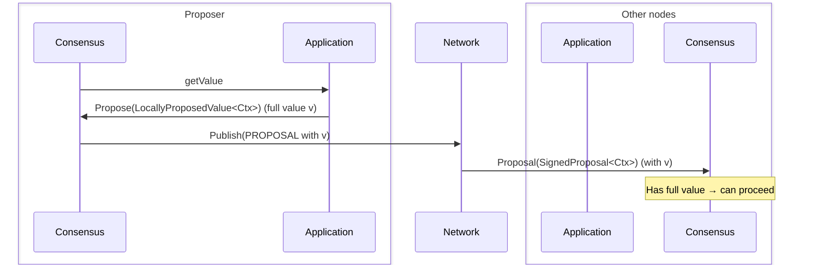
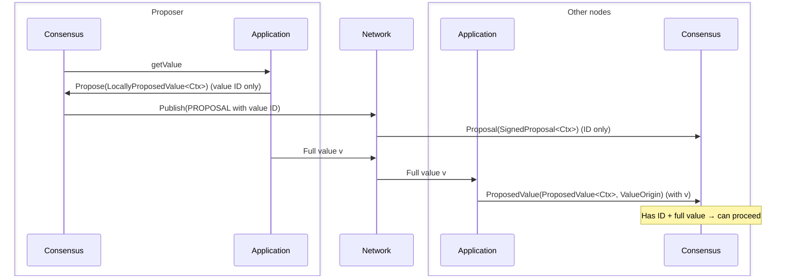
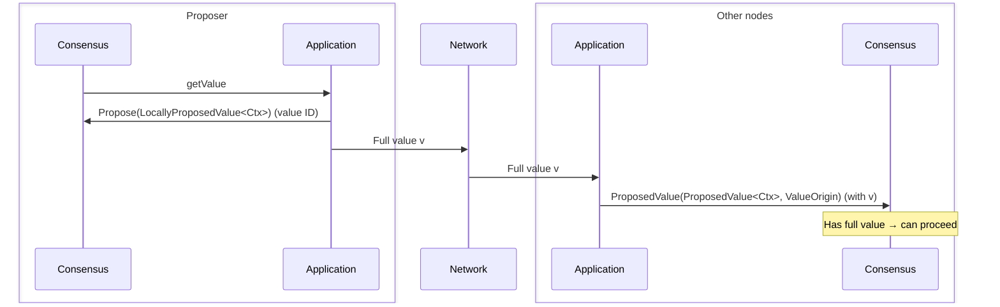

# ADR 003: Propagation of Proposed Values

## Changelog

* 2025-03-18: Context and description of the problem
* 2025-03-21: Current design description

## Context

Malachite implements a consensus algorithm, [Tendermint][consensus-spec], 
which allow processes to agree on a single decided value for each 
consensus instance or *height*. 

Possible decision values are provided by the software that uses the consensus, 
which we refer to generically as the *application*. There are 
no assumptions about what a **value** represents—its semantics are defined 
entirely by the application. For example, in blockchain applications, input 
values are blocks proposed to be appended to the blockchain.

Similarly, the consensus algorithm makes no assumptions about the **size** 
of the proposed values; they may be of arbitrary byte size. However, 
the application is expected to define a maximum size for proposed values 
and to configure the consensus parameters accordingly—most notably, 
the durations of timeouts.

When value size becomes a relevant factor, it is important to recognize 
that the consensus process comprises two distinct stages:

- **Value Propagation**: Proposed values must be transmitted to all consensus participants.
- **Value Decision**: One of the successfully propagated values is selected and decided.

The cost of **Value Propagation**, in terms of latency and bandwidth, 
clearly depends on the size of the proposed values. In contrast, the 
**Value Decision** stage should be independent of value size and 
incur a roughly constant cost.

In Tendermint, **Value Propagation** is performed via the `PROPOSAL` 
message, which is broadcast by the designated proposer of the round 
and includes the proposed value `v`.

The **Value Decision** phase involves `PREVOTE` and `PRECOMMIT` 
messages—collectively referred to as *votes*. Each vote includes 
either an identifier `id(v)` of the proposed value `v` or the 
special value `nil`. The function `id(v)` provides a compact 
representation of `v`, typically implemented as a fixed-size hash.

From this, we can see that **Value Propagation** is more challenging, 
as it involves disseminating potentially large amounts of data through 
the network. In contrast, the **Value Decision** phase requires only 
the transmission of vote messages, which are relatively small and of 
constant size. As a result, Malachite’s low-level API provides greater 
flexibility in the value propagation stage to enable more optimized 
implementations. 

In this document, we focus on the core parts of the consensus 
implementation responsible for **Value Propagation**.

## Current design

At the moment, Malachite consensus implementation is supporting three
different modes of operation to handle value propagation: 
1) **ProposalOnly**
2) **PartsOnly**
3) **ProposalAndParts**

A specific mode can be set as a `value_payload` consensus parameter (TODO: not sure if this is right code reference):

```rust
/// Consensus parameters.
#[derive_where(Clone, Debug)]
pub struct Params<Ctx: Context> {
   ...

    /// The messages required to deliver proposals
    pub value_payload: ValuePayload,

    ...
}

```


In the following, we examine each approach to understand how the consensus 
interacts with the environment, depending on the mode of operation adopted. 
Specifically, we focus on the consensus inputs related to value propagation. 
In general consensus inputs are how the consensus reacts to the events from 
the environment. A complete overview of all inputs processes by the consensus 
can be found in [ADR-004 Coroutine-Based Effect System for Consensus](./adr-004-coroutine-effect-system.md).


| **Input** | **Description** |
|-----------|-----------------|
| `Proposal(SignedProposal<Ctx>)` | This input is generated and passed to the consensus when a `PROPOSAL` message is received from the network. |
| `Propose(LocallyProposedValue<Ctx>)` | This input is produced by the application in response to a consensus request (`getValue`) for a value to propose. |
| `ProposedValue(ProposedValue<Ctx>, ValueOrigin)` | This input is also generated by the application when the application is responsible for disseminating values through the network. It informs the consensus that a value has been received. |


When processing each of these inputs, the consensus may produce various effects 
that must be handled by the environment to fully process the input. All such 
effects are described in more detail in [ADR-004](./adr-004-coroutine-effect-system.md). 
Here, our focus is limited to interactions related to value propagation and how they 
differ depending on the selected mode of operation.

### ProposalOnly



This approach most closely follows the original Tendermint 
algorithm. In this mode, the consensus generates the `getValue` effect to 
request a value from the application. The application responds by sending the 
`Propose(LocallyProposedValue<Ctx>)` input to the consensus, containing the 
value `v` that should be ordered.

The consensus then generates a `PROPOSAL` message that includes the actual 
value `v` received via `LocallyProposedValue<Ctx>`, and generate a `Publish` 
effect. This effect will be handled by the networking module, and the proposal,
with the full value embedded in it, will be disseminated through the network.

Upon receiving a `PROPOSAL` message from the network, the networking module 
generates a `Proposal(SignedProposal<Ctx>)` input, which is passed directly to 
the consensus for processing.

In this setup, the application only needs to provide a value to the consensus through `Propose(LocallyProposedValue<Ctx>)`, and value propagation is entirely handled by the networking module. The consensus only processes `PROPOSAL` messages that already contain the full value. As a result, the `ProposedValue(ProposedValue<Ctx>, ValueOrigin)` input is never generated by the application in this mode.

This setup is the simplest, as the application is only responsible for providing the value to be ordered. However, if the value is large, the resulting `PROPOSAL` messages will also be large and must be propagated as such through the network. Any optimizations for value propagation, such as chunking the value into smaller parts and reassembling it on the receiving side, must be implemented at the networking level. This is because both the consensus and application remain unaware of how the value is transmitted.

The other two modes of operation are designed to support such optimizations at the application level rather than at the network level. We will explore how this is achieved in the following sections.

### ProposalAndParts



In this mode of operation, the application is responsible to propagate the full value `v`.
Consequently, as a response to `getValue`, the application generates `Propose(LocallyProposedValue<Ctx>)` input 
that does not contain the full value `v`, but instead carries a value identifier. As a result, the `PROPOSAL`
message generated by consensus upon processing this input includes only the value identifier, 
not the full value. Nevertheless, in this mode, the consensus generates the `Publish` effect and this `PROPOSAL`
message is disseminated through the network via networking module. 

When a node receives a `PROPOSAL` message in this mode, the networking module generates the `Proposal(SignedProposal<Ctx>)` 
input and passes it to the consensus. However, in this mode, receiving a `Proposal(SignedProposal<Ctx>)` alone is not 
sufficient for the consensus to consider the proposal complete. The consensus must also receive confirmation from 
the application that the full value corresponding to the identifier in the `PROPOSAL` has been obtained.

This confirmation is delivered via the `ProposedValue(ProposedValue<Ctx>, ValueOrigin)` input, 
which the application generates upon receiving the full value through the network. Only when the consensus has both 
inputs `Proposal(SignedProposal<Ctx>)` with a value identifier and `ProposedValue(ProposedValue<Ctx>, ValueOrigin)` 
with the matching full value, it can consider the proposal complete. At that point, it proceeds as it would 
in the `ProposalOnly` mode upon receiving a `Proposal(SignedProposal<Ctx>)` input.

In this approach, dissemination of the full value is delegated to the application. Specifically, the application 
is responsible for distributing the full value across the network. So the application is albe to chunk
the value into parts, broadcasting these parts using the networking module, and then informing the consensus 
once all parts have been received and reassembled. 

### PartsOnly



This mode is very similar to `ProposalandParts` but the difference is that when receiving 
`Propose(LocallyProposedValue<Ctx>)` input from the application the consensus doesn't do anything. Namely, 
the `Publish` effect is not created and the `PROPOSAL` message is not sent through the network. Instead, 
it waits to receive `ProposedValue(ProposedValue<Ctx>, ValueOrigin)` input from the application and when
this happens the consensus considers the proposal as complete and proceed. The application generates this 
input upon receiving the full value from the network. As a result, in this case
value propagation is totally delegated to the application. 

To sum up, in different modes, different inputs are required to achieve the same effect as receiving 
the `PROPOSAL` message in the original Tendermint algorithm. 

- In `ProposalOnly`, a single `Proposal(SignedProposal<Ctx>)` input is sufficient.
- In `ProposalAndParts`, both `Proposal(SignedProposal<Ctx>)` and `ProposedValue(ProposedValue<Ctx>, ValueOrigin)` inputs are needed.
- In `PartsOnly`, only `ProposedValue(ProposedValue<Ctx>, ValueOrigin)` input is enough, as no `PROPOSAL` message is sent over the network.


### `TimeoutPropose`
An important consideration is that, regardless of the mode of operation, all inputs required to complete a 
proposal must be received by the consensus before `timeoutPropose` expires. This timeout must be configured 
to accommodate for the time needed for a complete value propagation. This is especially important
in cases where the value is large and requires longer to be propagated through the network.


## Alternatives

This section presents a (possibly not comprehensive) list of approaches to
handle **Value Propagation** for consensus protocols in general, and for
Tendermint in particular, discussing the pros and cons of each of them.

### Consensus by Value

In this approach, the consensus implementation plays both the
**Value Propagation** and **Value Decision** roles.

This means that a `PROPOSAL(h, r, v, vr)` consensus message broadcast by a
process carries its proposed value `v`.
Other processes learn the proposed value `v` when they receive the associated
`PROPOSAL` message.

As previously discussed, the vote messages (`PREVOTE` and `PRECOMMIT`) do not
carry the proposed value `v`, but a short representation `id(v)` of it.
A process cannot sign a vote for `id(v)` if it does not know the value `v`.
So receiving `PROPOSAL` message carrying the value `v` is a requirement for
signing a vote for `id(v)`.

If the round of consensus is successful, the value `v` carried by the round's
`PROPOSAL` message is the value delivered to the application as the decision
for that height of consensus.

Malachite, in `ProposalOnly` mode, when the application returns a full value in 
`Propose(LocallyProposedValue<Ctx>)`, follows this approach.


### Consensus by Reference

In this approach, the application is responsible for implementing the
**Value Propagation** stage,
while the consensus algorithm implements **Value Decision** stage.

This means that a `PROPOSAL(h, r, v, vr)` consensus message broadcast by a
process does not carry the value proposed by this process.
The value `v` ordered by the consensus algorithm is instead a reference, a
description, or an identifier of the value actually proposed by the process,
whose propagation is a responsibility of the application.

So if a process wants to propose a value `V` using this approach, it has:
(i) to propagate `V` to all processes, then (ii) produce a reference `v` of the
proposed value `V` and provide `v` to the consensus implementation.
On the receive side, a process that receives a `PROPOSAL` carrying `v` should
ensure that the referenced value `V` has been received as well.
Only in this case, the process can deliver the `PROPOSAL` for `v` to the
consensus implementation.

Since the values that are proposed and decided by consensus are references to
actually proposed values, `v` is expected to be a short representation of `V`.
For this reason, the optimization of having vote messages carrying `id(v)`
instead of `v` becomes pretty much irrelevant.

If the round of consensus is successful, the reference `v` carried by the
round's `PROPOSAL` message is the value delivered by the consensus
implementation as the decision for that height.
But the actual decision value for that height of consensus is `V`, the value
referenced by `v`.
It is `V` and not `v` that should be delivered to the application.

Notice, however, that a value can only be decided by the consensus
implementation if a `PROPOSAL` message carrying that value was previously
decided.
As already mentioned, in this approach, a `PROPOSAL` message carrying a
reference `v` can only be delivered to the consensus implementation if the
referenced value `V` is known by the process.
Therefore, a process where `v` is decided by the consensus implementation
should be able to deliver the actual proposed value `V` to the application.

Malachite, when used in `ProposalAndParts` and `PartsOnly` modes, represents 
a variant of this approach in which the dissemination of full values is 
entirely delegated to the application.


## Decision


## Status

Proposed

## Consequences


### Positive

### Negative

### Neutral

## References

* [Tendermint consensus specification][consensus-spec]

[consensus-spec]: ../../specs/consensus/README.md
[consensus-code]: ../../specs/consensus/pseudo-code.md
[consensus-proposals]: ../../specs/consensus/overview.md#proposals
[consensus-votes]: ../../specs/consensus/overview.md#votes
[adr001]: ./adr-001-architecture.md
