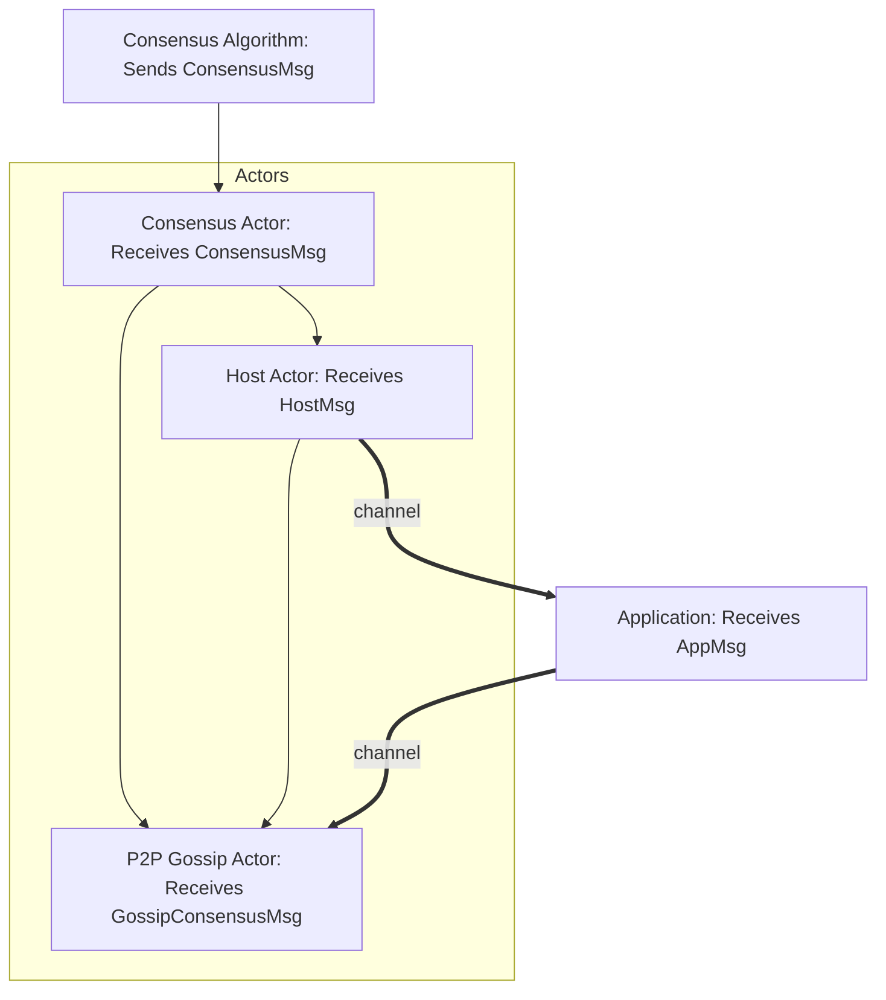
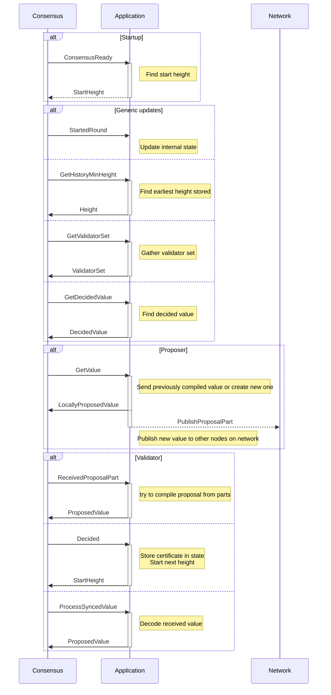

# Application using tokio channels

## Table of contents
1. [Introduction](#introduction)
2. [Prerequisites](#prerequisites)
3. [Concepts](#concepts)
   * [The `malachite_app_channel` crate](#the-malachite_app_channel-crate)
   * [Consensus types](#consensus-types)
   * [The `Context` trait](#the-context-trait)
   * [The `Codec` trait](#the-codec-trait)
   * [The `Node` trait](#the-node-trait)
   * [Consensus engine messages](#consensus-engine-messages)
4. [Putting it all together](#putting-it-all-together)

## Introduction
In this tutorial we will build an example validator application using the Malachite libraries. The focus is
integration with the Malachite consensus engine using tokio channels.


## Prerequisites
The tutorial assumes basic knowledge of asynchronous programming in Rust using the tokio library. The beginner
Rust knowledge is essential, the asynchronous programming knowledge is recommended.

The tutorial assumes basic distributed systems knowledge, for example: what is a validator, what is a Proof-of-Stake
consensus engine.

Knowledge of [CometBFT](https://cometbft.com) or other Byzantine-fault tolerant consensus engines may help with
understanding the consensus engine concepts, however it is not required.


## Concepts
First, we will get familiar with the concepts (usually Rust traits) used in Malachite.

### The `malachite_app_channel` crate
An example application will require only a few of the Malachite crates. The `malachite_app_channel` crate has all the
necessary components to interact with the consensus engine using tokio channels. The crate also re-exports the necessary
types and traits from the `malachite_app` crate under `malachite_app_channel::app::types` for easier consumption.


### Consensus types
The basic consensus types, like `Height` of a network, `Address` of a wallet, description of a `Validator` or list of
validators (`ValidatorSet`) are defined as traits in `malachite_app_channel::app::types`.

For example, the `Height` trait requires these three methods to be implemented:
* `increment_by`
* `decrement_by`
* `as_u64`

Additional methods, like `increment` or `decrement` have default implementations that can be overwritten.

Example implementation of the `Height` trait:
```rust
/// A blockchain height
#[derive(Copy, Clone, PartialEq, Eq, PartialOrd, Ord, Hash, Serialize, Deserialize)]
pub struct Height(u64);

impl malachite_app_channel::app::types::Height for Height {
    fn increment_by(&self, n: u64) -> Self {
        Self(self.0 + n)
    }

    fn decrement_by(&self, n: u64) -> Option<Self> {
        Some(Self(self.0.saturating_sub(n)))
    }

    fn as_u64(&self) -> u64 {
        self.0
    }
}
```
This implementation is an excerpt from a struct implemented in the `malachite_test` crate.

For the sake of simplicity we will use these pre-defined types instead of defining our own Context types. In a more
complex case, these are the types that we will need to implement or borrowed from `malachite_test`:

* `SigningProvider`
* `Address`
* `Height`
* `NilOrVal`
* `Proposal`
* `ProposalPart`
* `Round`
* `SigningScheme`
* `Validator`
* `ValidatorSet`
* `Value`
* `ValueId`
* `Vote`

Note the `malachite_test::Vote` implementation:
```rust
#[derive(Copy, Clone, Debug, PartialEq, Eq, PartialOrd, Ord, Serialize, Deserialize)]
pub struct Value(u64);

impl malachite_app_channel::app::types::Value for Value {
    type Id = ValueId;

    fn id(&self) -> ValueId {
        self.id()
    }
}
```
The test implementation is only capable of shipping a single value in a transaction. We will use this for now, but in
subsequent examples we will need to implement a more complex `Value` type.

### The `Context` trait
The Malachite Consensus Context trait defines abstractions over the various data types used in the consensus engine.
It is defined in `malachite_app_channel::app::types::Context` and an example implementation can be seen at
`malachite_test::Context`. The types defined so far will be added to the `Context` implementation so the consensus
engine understands what it will work with.


### The `Codec` trait
Nodes on the network need to communicate with each other. Implementing the `encode` and `decode` methods of the
`malachite_code::Codec` trait defines how the types sent over the wire. Typically, protobuf is a very common choice
for encoding/decoding messages but to keep modularity flexible, there is no default implementation. The
`malachite_test::codec::proto::ProtobufCodec` implementation can be used as an example, and for testing.

At least the following types need to have a `Codec` implementation:
* `Value`
* `ProposalPart`

The following types are also sent over the wire and need a Codec implementation:
* `malachite_app_channel::app::types::SignedConsensusMsg<Context>`
* `malachite_app_channel::app::types::streaming::StreamMessage<ProposalPart>`

The `malachite_sync` crate provides structs that are used during synchronization among different nodes. These messages
also need to be encoded and decoded when sent over the wire:
* `malachite_sync::Status`
* `malachite_sync::Request`
* `malachite_sync::Response`
<!-- Todo: re-export malachite_sync in malachite_app -->

### The `Node` trait
The `Node` trait is the interface between the application configuration and Malachite.

The `malachite_app_channel::app::Node` trait defines the encryption algorithm used for generating the private signing key,
loading it from a file system, and calculating the public key or the wallet address from it. It is also responsible for
loading the Genesis file from the file system or generating one for testing purposes.

The `Node::run()` method is the entry point for the application where the initial configuration is loaded and parsed and
the Malachite actors (consensus engine, network, etc.) are started.


### Consensus engine messages
The consensus engine will send messages to the application, describing the current state of the engine. In cases when a
`reply_to` field is present, the application will need to send a response back to the consensus engine. In any case,
the message received can be used to change the internal state of the application: save data onto a database, send a
message to a node, etc.

The application can send messages through the network. A tokio channel is provided for this purpose that
connects to the peer-to-peer layer.

The internal implementation of Malachite is based on the Actor model. The `malachite_app_channel` crate provides the
necessary tokio channel implementations that hook into this model so the application does not have to implement the Actor
model.


[Chart: malachite-app-channel](https://mermaid.live/view#pako:eNp1kr1uwjAURl_lykMHBB06RgIVtVK7IKHSqaTDxb7EVuMf2Q5VBbx7nQRIGmiGKPl0jmV_vnvGrSCWsW1pv7lEH3MD6XmyJpAJVZiXhfUqSr2-RHDJMhityIjQ4YtQjD4HS_RNHq1P1htxUju6Lb7YEJTr9OXD8pRd-wO2t8qrDXFdv66lOu2Rc-dKxTEqa9a9776R4pNwPpvWZOLjHoJERxlsPHIKYyhxQ2UGOVtZTaApBCySL3FHgOApuHqr4NCjpkj-Ht4lpQA9gbERBDnFI4n7nB3_uwmYTGZd3FKh2hQenWwPewr_6I01qAvumi46uunrBtgS6aq7bmE6nc4OaWSMofLQL_Gq1QE6WJuNmSavUYk0hvtazlmUpClndZEC_VfOcnNMHFbRrn4MZ1n0FY2Zt1UhWbbFMqS_ygmM9KwwNaHPiEPzYa2-QCRUKmjRDn0z-8dfj68LYA)

The following `malachite_app_channel::AppMsg` messages can be received and have to be implemented for the application
to interact with the consensus engine:

| Message              | Description                                                                                                                                                                                                                                                                                                                                                                                                                                |
|----------------------|--------------------------------------------------------------------------------------------------------------------------------------------------------------------------------------------------------------------------------------------------------------------------------------------------------------------------------------------------------------------------------------------------------------------------------------------|
| ConsensusReady       | Notifies the application that consensus is ready. The application MAY reply with a message to instruct consensus to start at a given height.                                                                                                                                                                                                                                                                                               |
| StartedRound         | Notifies the application that a new consensus round has begun.                                                                                                                                                                                                                                                                                                                                                                             |
| GetValue             | Requests the application to build a value for consensus to run on. The application MUST reply to this message with the requested value within the specified timeout duration.                                                                                                                                                                                                                                                              |
| RestreamProposal     | Requests the application to re-stream a proposal that it has already seen. The application MUST re-publish again all the proposal parts pertaining to that value by sending `NetworkMsg::PublishProposalPart` messages through the `Channels::network` channel.                                                                                                                                                                            |
| GetHistoryMinHeight  | Requests the earliest height available in the history maintained by the application. The application MUST respond with its earliest available height.                                                                                                                                                                                                                                                                                      |
| ReceivedProposalPart | Notifies the application that consensus has received a proposal part over the network. If this part completes the full proposal, the application MUST respond with the complete proposed value. Otherwise, it MUST respond with `None`.                                                                                                                                                                                                    |                                                                                                                                                                                                                    |
| GetValidatorSet      | Requests the validator set for a specific height.                                                                                                                                                                                                                                                                                                                                                                                          |
| Decided              | Notifies the application that consensus has decided on a value. This message includes a commit certificate containing the ID of the value that was decided on, the height and round at which it was decided, and the aggregated signatures of the validators that committed to it. In response to this message, the application MAY send a `ConsensusMsg::StartHeight` message back to consensus, instructing it to start the next height. |
| GetDecidedValue      | Requests a previously decided value from the application's storage. The application MUST respond with that value if available, or `None` otherwise.                                                                                                                                                                                                                                                                                        |
| ProcessSyncedValue   | Notifies the application that a value has been synced from the network. This may happen when the node is catching up with the network. If a value can be decoded from the bytes provided, then the application MUST reply to this message with the decoded value.                                                                                                                                                                          |
<!-- Todo: Is RestreamProposal obsolete? -->

### Application state
The application needs to maintain its internal state so it can react to the messages received from consensus.
Usually, this means implementing mempool, storing the data in a database, running an RPC server for queries or
interacting with other parties off-the-network.

## Putting it all together
Now that we have all the context necessary to interact with the Malachite consensus engine, we can start building our
application.

### Input parameters
Users are used to providing input parameters to the application. This is outside the scope of Malachite, but for testing
purposes there is one implementation that we can use without creating our own.

```rust
use malachite_test_cli::args::Args;

fn main() {
   // Load command-line arguments and possible configuration file.
   let args = Args::new();
}

```

The `malachite_test_cli` crate uses the `clap` library to parse the command-line and provide input parameters like
`--home` as well as commands like `init`, `start` or `testnet`.

These work similarly to CometBFT: `init` creates initial configuration in `$HOME/.malachite`, `testnet` does the same but
it creates multiple configuration (make sure `--nodes` is set) with a valid genesis file, and `start` runs the node.


### Logging
It is up to the application integrator to implement logging. However, to simplify debugging the internals of Malachite,
the `tracing` library is used for logging internally. It can also be used for the applications purposes, so we will just
do that.

```rust
fn main() {
   // Load configuration file if it exists. Some commands do not require a configuration file.
   let opt_config_file_path = args
           .get_config_file_path()
           .map_err(|error| eyre!("Failed to get configuration file path: {:?}", error));

   let opt_config = opt_config_file_path.and_then(|path| {
      load_config(&path, None)
              .map_err(|error| eyre!("Failed to load configuration file: {:?}", error))
   });

   // Override logging configuration (if exists) with optional command-line parameters.
   let mut logging = opt_config.as_ref().map(|c| c.logging).unwrap_or_default();
   if let Some(log_level) = args.log_level {
      logging.log_level = log_level;
   }
   if let Some(log_format) = args.log_format {
      logging.log_format = log_format;
   }

   // This is a drop guard responsible for flushing any remaining logs when the program terminates.
   // It must be assigned to a binding that is not _, as _ will result in the guard being dropped immediately.
   let _guard = logging::init(logging.log_level, logging.log_format);

}
```
Note that we extract any logging configuration from the configuration file if it exists and override them with the input
parameters provided on the command-line. There are cases (for example when the `init` command is called) when it is not
guaranteed that a logging file exists.

By the time the `start` command is run, the configuration should be in place.

```rust
fn main() {
   let mut config = opt_config
           .map_err(|error| error!(%error, "Failed to load configuration."))
           .unwrap();

   config.logging = logging;
}
```
### Create the application object
Now we are getting to the meat of it. The configuration loaded, we have to load the private key used for signing and
start the application. This is where the `Node::run` method comes in.

```rust
use async_trait::async_trait;
use libp2p_identity::Keypair;
use malachite_app_channel::app::Node;

// Normally you implement your own types, as discussed above. We use the types defined for testing so we can focus on
// the integration instead.
use malachite_test::codec::proto::ProtobufCodec;
use malachite_test::{
   Address, Genesis, Height, PrivateKey, PublicKey, TestContext, Validator, ValidatorSet,
};

/// Main application struct implementing the consensus node functionality
#[derive(Clone)]
pub struct App {
   // ... data to store the folders and configuration
}

#[async_trait]
impl Node for App {
    type Context = TestContext;
    type Genesis = Genesis;
    type PrivateKeyFile = PrivateKey;

    fn get_home_dir(&self) -> PathBuf {/*...*/}
    fn generate_private_key<R>(&self, rng: R) -> PrivateKey where R: RngCore + CryptoRng, {/*...*/}
    fn get_address(&self, pk: &PublicKey) -> Address {/*...*/}
    fn get_public_key(&self, pk: &PrivateKey) -> PublicKey {/*...*/}
    fn get_keypair(&self, pk: PrivateKey) -> Keypair {/*...*/}
    fn load_private_key(&self, file: Self::PrivateKeyFile) -> PrivateKey {/*...*/}
    fn load_private_key_file(&self, path: impl AsRef<Path>) -> std::io::Result<Self::PrivateKeyFile> {/*...*/}
    fn make_private_key_file(&self, private_key: PrivateKey) -> Self::PrivateKeyFile {/*...*/}
    fn load_genesis(&self, path: impl AsRef<Path>) -> std::io::Result<Self::Genesis> {/*...*/}
    fn make_genesis(&self, validators: Vec<(PublicKey, VotingPower)>) -> Self::Genesis {/*...*/}

    async fn run(self) -> eyre::Result<()> {
        let span = tracing::error_span!("node", moniker = %self.config.moniker);
        let _enter = span.enter();

        let private_key_file = self.load_private_key_file(&self.private_key_file)?;
        let private_key = self.load_private_key(private_key_file);
        let public_key = self.get_public_key(&private_key);
        let address = self.get_address(&public_key);
        let ctx = TestContext::new(private_key);

        let genesis = self.load_genesis(self.genesis_file.clone())?;
        let initial_validator_set = genesis.validator_set.clone();
        let start_height = self.start_height.map(Height::new);

        let codec = ProtobufCodec;

        let mut channels = malachite_app_channel::run(
            ctx.clone(),
            codec,
            self.clone(),
            self.config.clone(),
            self.private_key_file.clone(),
            start_height,
            initial_validator_set,
        )
        .await?;

        let mut state = State::new(ctx, address, start_height.unwrap_or_default());

        crate::app::run(genesis, &mut state, &mut channels).await
    }
}

fn main() {
   // Create the application object.
   let mut node = App {
      home_dir: args.get_home_dir()?,
      config,
      genesis_file: args.get_genesis_file_path()?,
      private_key_file: args.get_priv_validator_key_file_path()?,
      start_height: Default::default(), // placeholder, because start_height is only valid in StartCmd.
   };

    let runtime = config.runtime;

    let metrics = config.metrics.enabled.then(|| config.metrics.clone());

    // Define the runtime. If you are not interested in a custom runtime configuration,
    // you can use the #[async_trait] attribute on the main function.
    let rt = runtime::build_runtime(runtime)?;
    rt.block_on(cmd.run(node, metrics))
        .map_err(|error| eyre!("Failed to run start command {:?}", error));
}
```

Continuing the main function's steps, we create the `App` object that defines our application and run its `run()` method.

The above App implementation ignores the implementation of the configuration storage in the `App` struct and file load
functionality. These are trivial to implement, and an example is implemented in the `malachite_test` crate.

In the `run()` method, the private key is loaded, the public key and address is calculated and then the Consensus Context
is created. In our example application we will use the `malachite_test::TestContext` but as it was discussed above, a
custom `Context` should be implemented for more complex applications.

After loading the Genesis file and creating the validator set, the network `Codec` is also instantiated. (See above for
implementation details.)

With everything ready, we can call `malachite_app_channel::run()` to start the Actor framework (consensus engine and
peer-to-peer network) and receive the communication channels in a `Channels` struct.

### State
A minimal (in-memory) state can be created to maintain knowledge of the height, round and data transmitted.

```rust
/// Represents the internal state of the application node
/// Contains information about current height, round, proposals and blocks
pub struct State {
    ctx: TestContext,

    pub current_height: Height,
    pub current_round: Round,
    pub current_proposer: Option<Address>,

    address: Address,
    stream_id: u64,
    undecided_proposals: HashMap<(Height, Round), ProposedValue<TestContext>>,
    decided_proposals: HashMap<Height, ProposedValue<TestContext>>,
    decided_values: BTreeMap<Height, DecidedValue<TestContext>>,
    streams_map: PartStreamsMap,
    rng: StdRng,
}
```

This will be useful when the application responds back to the consensus engine.

## The consensus dialog
Most Consensus messages have a `reply_to` field that the application should use to respond to the message. To understand
better how to implement responses to these messages, let's look at the dialog between the consensus engine and the application.


<!-- Todo: talk about the minimal amount of conversation needed to run the engine. List the known caveats that would
make consensus start new rounds but not finalize any heights. Like mismatched values. -->
