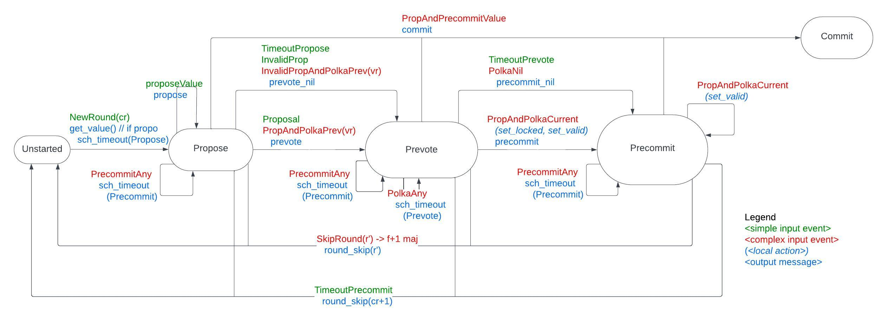

# Malachite Documentation

Malachite is an implementation of the [Tendermint consensus algorithm][arxiv] in Rust.
It comes together with an executable specification in [Quint][quint-spec]. We use
model-based testing to make sure that the implementation corresponds to the 
specification.

Tendermint consensus algorithm works by a set of validator nodes exchanging messages over a
network, and the local consensus instances act on the incoming messages if
certain conditions are met (e.g., if a threshold number of specific messages is
received a state transition should happen). The 
architecture of Malachite separates

- counting messages in a *vote keeper* ([Quint][quint-votekeeper]),
- creating consensus inputs in a *driver* ([Quint][quint-driver]), e.g., if a threshold is reached
- doing the state transition depending on the consensus input in the *state machine* ([Quint][quint-sm])

A detailed executable specification of these functionalities are given in Quint.
In this (English) document we discuss some underlying principles, namely,

- [Message handling](#messages-to-events): How to treat incoming messages. Which messages to store, 
and on what conditions to generate consensus inputs.

- [Round state machine](#round-state-machine): How to change state depending on the
current state and a consensus input.


## Messages to Events

The consensus state-machine operates on complex Events that reflect the
reception of one or multiple Messages, combined with state elements and the
interaction with other modules.

The Tendermint consensus algorithm defines three message types, each type
associated to a round step:

- `PROPOSAL`: broadcast by the proposer of a round at the `propose` round step.
  Carries the value `v` proposed for the current height of consensus.
  Only proposed values can be decided.
- `PREVOTE`: broadcast by validators at the `prevote` round step.
  Carries either the unique identifier `id(v)` of a proposed value `v`,
  in the event that the proposed value was accepted,
  or the special `nil` value, otherwise
  (i.e., when the proposed value has not been received
  or when it was received but not accepted).
- `PRECOMMIT`: broadcast by validators at the `precommit` round step.
  Carries either the unique identifier `id(v)` of a proposed value `v`,
  in the event that the proposed value was accepted by `2f + 1` validators,
  or the special `nil` value, otherwise.
  A value is decided when it receives `2f + 1` precommits.

This section overviews how messages should be handled at different stages of
the protocol.

### Proposals

Messages `⟨PROPOSAL, h, r, v, vr⟩` are generically called proposals.
They are produced at the `propose` round step and are inputs for all round
steps.
General assumptions regarding proposal messages:

- Proposal messages are produced, signed and broadcast by a validator,
  referred the message's *sender*.
- The sender of a proposal message of round `(h, r)` must be the proposer of
  round `(h, r)`. The proposer of a round is deterministically computed from
  the round identifier `(h, r)` and the validator set of height `h`.
- Proposal messages are the only messages carrying a (full) proposed value `v`.
  Knowing the proposed value `v` of a round `(h, r)` is a requirement for
  voting for `v` and for deciding `v` in round `(h, r)`.
- Correct validators only broadcast a proposal message in a round if they are
  the proposer of that round.
  A correct proposer broadcasts a single proposal message, carrying a single
  value `v`, per round.
- Byzantine validators may broadcast proposal messages in rounds where they
  are not the round's proposer.
  - Correct validators can easily identify this attack and ignore such
    invalid proposal messages.
- A Byzantine validator that is the proposer of a round may broadcast multiple
  proposal messages, carrying distinct proposed values, in that round.
  This behaviour constitutes an equivocation attack.
  - A correct validator could in thesis only consider the first proposal
    message received for a round, say it proposes `v`.
    The problem of this approach is that `2f + 1` validators might accept, or
    even decide, a different value `v' != v`.
    By ignoring the equivocating proposal for `v'`, the validator will not be
    able to vote for or decide `v'`, which in Tendermint consensus algorithm
    may compromise liveness.
  - Storing multiple proposal messages for the same round is, by itself, an
    attack vector. Validators must thus restrict the number of proposal
    messages stored in rounds where multiple proposals are produced.

### Counting votes

Messages `⟨PREVOTE, h, r, *⟩` and `⟨PRECOMMIT, h, r, *⟩` are generically called votes.
They refer to a round step `(h, r, s)` of consensus, where `s` is defined by
the vote type, either `prevote` or `precommit`.

The processing of _individual_ vote messages doesn't produce events relevant for
the consensus state machine.
But when the number of unique vote messages referring to a given round step
`(h, r, s)` reaches a given _threshold_, relevant events are produced;
the produced event depends on the value carried by such votes.

General assumptions regarding vote messages:

- Vote messages are produced, signed and broadcast by a validator,
  referred the message's *sender*.
  - The sender of a vote message must be part of the current *validator set*.
    To define whether a vote message from height `h` is valid, the validator
    set for height `h` must be known.
- To each validator in the validator set of a height `h` is associated a *voting power*.
  - Thresholds are computed from the voting power associated to the
    sender of each vote message.
- A vote message carries either the unique identifier `id(v)` of a proposed
  value `v`, or the special `nil` value.
- Correct validators broadcast at most one vote message per round step:
  carrying either a `id(v)` or `nil`.
- Byzantine validators may broadcast multiple distinct vote messages for the same
  round step: equivocation attack. Equivocating vote messages differ on the
  value they carry: `nil`, `id(v)`, `id(v')` with `v' != v`.
  - A correct validator could in thesis only consider the first vote message
    received from a sender per round step, say it carries `id(v)`.
    The problem of this approach is that `2f + 1`  validators might only
    consider a different vote message from the same sender and round step,
    carrying `id(v')` with `v' != v`. This may lead other validators to decide `v'`.
    By ignoring the equivocating voting message carrying `id(v')`, the
    validator might not be able to decide `v'`, which may compromise
    liveness of the consensus algorithm.
  - Storing multiple vote messages from the same sender and referring to the
    same round step is, by itself, an attack vector. Validators must thus
    restrict the number of votes stored per sender and round step.

#### `f + 1` threshold

This threshold represents that vote messages referring to a round step were
received from a enough number of unique senders, so that it is guaranteed that
_at least one_ of the senders is a correct validator.

The rationale here is that the cumulative voting power of Byzantine validators
cannot exceed `f`, so that at least one of the considered vote messages must
have been produced by a correct validator.

#### `2f + 1` threshold

This threshold represents that vote messages referring to a round step were
received from a enough number of unique senders, so that it is guaranteed that
the voting power of senders that are correct validators exceeds the voting
power of senders that might be Byzantine validators.
In a simplified setup, where validators have the same voting power, the
`2f + 1` threshold guarantees that _the majority_ of the senders are correct
validators.

The rationale here is that the cumulative voting power of Byzantine validators
cannot exceed `f`, so that the subset of considered vote messages that must
have been produced by correct validators have a cumulative voting power of at
least `f + 1`, which is strictly greater than `f`.

### Different rounds

Messages matching the current height and round of a validator produce most of
the relevant events for the consensus state machine.
Messages from different rounds, however, also trigger relevant events.

This section assumes that a validator is at round `r` of height `h` of
consensus, or in short, at round `(h, r)`.

#### Previous rounds

The consensus state machine has events requiring messages from previous rounds
`(h, r')` with `r' < r`:

- `PREVOTE` messages may be required to produce a Proof of Lock (POL or Polka) for a
  value `v` needed for accepting a `PROPOSAL(h, r, v, vr)` message, with
  `0 ≤ vr < r`, of the current round (L28).
  - A Polka for `v` at round `vr` is a `2f + 1` threshold of `⟨PREVOTE, h, vr, id(v)⟩` messages.
- `PROPOSAL` messages from previous rounds can be required to decide a value
  (L49), see more details below.
- `PRECOMMIT` messages can produce a `2f + 1` threshold of `⟨PRECOMMIT, h, r', id(v)⟩`
   messages which, together with a `PROPOSAL(h, r', v, *)` message, 
  leads to the decision of `v` at round `r'` (L49).

As a result, a validator needs to keep track of messages from previous
rounds to produce the enumerated events:

1. `PROPOSAL` messages should be maintained when a validator moves to higher rounds,
   as well as new `PROPOSAL` messages from previous rounds should be stored.
   - Reason I: a `2f + 1` threshold of `⟨PRECOMMIT, h, r', id(v)⟩` messages
     could still be obtained, and an existing proposal message for `v` in the
     previous round `r' < r` enables the validator to decide `v`.
   - Reason II: a `2f + 1` threshold of `⟨PRECOMMIT, h, r', id(v)⟩` messages
     was already obtained, but the proposal message for `v` at round `r'`
     is missing. Once received, the validator can decide `v`.
2. `PREVOTE` messages should be maintained when a validator moves to higher rounds,
   as well as new `PREVOTE` messages from previous rounds should be stored.
   - Reason I: a `PROPOSAL(h, r, v, vr)` with `0 ≤ vr < r` can be received in
     the current round, requiring an existing `2f + 1` threshold of `⟨PREVOTE, h, vr, id(v)⟩` messages.
   - Reason II: a `2f + 1` threshold of `⟨PREVOTE, h, vr, id(v)⟩` messages
     can still be obtained and unblock the processing of `PROPOSAL(h, r, v, vr)`
     received in the current round.
   - Observe that `PREVOTE` messages for `nil` do not need to be maintained or stored.
3. `PRECOMMIT` messages should be maintained when a validator moves to higher rounds,
   as well as new `PRECOMMIT` messages from previous rounds should be stored.
   - Reason I: a `2f + 1` threshold of `⟨PRECOMMIT, h, r', id(v)⟩` messages
     can be obtained, and there is a proposal message for `v` in round
     `r'`, leading the validator to decide `v`.
   - Reason II: a `2f + 1` threshold of `⟨PRECOMMIT, h, r', id(v)⟩` messages
     can be obtained, but there is no proposal message for `v` in round
     `r'`. This enables Reason II of 1., i.e., receiving a late proposal.

#### Future rounds

The consensus state machine requires receiving and processing messages from
future rounds `(h, r')` with `r' > r` for enabling the _round skipping_ mechanism.
This mechanism is defined in the pseudocode as follows:

```
55: upon f + 1 ⟨∗, hp, round, ∗, ∗⟩ with round > roundp do
56:   StartRound(round)
```

The definition is ambiguous and the event triggering round skipping can be
interpreted in two main ways:

1. Messages of any type and round `r' > r` are received so that the
   `f + 1` threshold is reached.
2. Messages of a given type and round `r' > r` are received so that the
   `f + 1` threshold is reached.

Since proposal messages for a round have a single sender, the round's proposer,
in both interpretations the vote messages are the ones that really count
towards the `f + 1` threshold.
The question then is whether we count the senders of `PREVOTE` and `PRECOMMIT`
messages separately (i.e., one set per vote type) or together.

According to the vote keeper [spec in Quint][quint-votekeeper], the
first interpretation has been adopted.
Namely, the senders of both `PREVOTE` and `PRECOMMIT` messages of a round `r' > r`
are counted together towards the `f + 1` threshold.

#### Limits

The same reasoning applied for messages from [future heights](#different-heights)
applies for messages from future rounds.

Messages from future rounds are _required_ for the proper operation of the
consensus state machine once the process reaches their round `r'`.
There are two options, which can in particular be combined:

1. Buffer a limited amount of such messages, or messages from a limited amount
   of future rounds `r'`
   - In CometBFT's implementation, only messages from round `r' = r + 1` are tracked.
2. Assume that the communication subsystem (p2p) is able to retrieve (ask for
   retransmission) of messages from future rounds when the process reaches round `r'`.
   Since messages from [previous rounds](#previous-rounds) are stored by
   default, peers that have reached the future round `r'` should be able to
   retransmit them.

### Different heights

Messages with heights `h'` with either `h' < h` (past) or `h' > h` (future).

The pseudocode description of the algorithm ignores messages from different
heights.
If we take the same approach in this specification, we have to specify
separately modules responsible to handle those messages.


- Past heights (`h' < h`): the consensus state machine is not affected by such
  messages. However, their reception might indicate that a peer is lagging
  behind in the protocol, and need to be synchronized.
  - In CometBFT's implementation we handle message from the previous height
    (`h' = h - 1`) for the `LastCommit` vote set. This only happens during the
    first step of the first round (`r = 0`) of a height.
- Future heights (`h' > h`): the consensus state machine is not able to process
  message from future heights in a proper way, as the validator set for them is
  not known. However, once the process reaches this height `h'`, those messages
  are _required_ for proper operation. There are two options here:
  1. Buffer a limited amount of such messages
  2. Assume that the communication subsystem (p2p) is able to retrieve (ask for
     retransmission) of them when the process reaches height `h'`.
     Notice that this option implies that processes keep a minimal set of
     consensus messages that enables peers lagging behind to decide a past height.


## Round state machine

The consensus state-machine operates on complex `Event`s that reflect the
reception of one or multiple `Message`s, combined with state elements and the
interaction with other modules.

The state machine represents the operation of consensus at a single `Height(h)` and `Round(r)`.
The diagram below offers a visual representation of the state machine. It shows the input events, using green for simple inputs (e.g. timeouts, proposal)
and red for the complex events (e.g. `ProposalAndPolkaCurrent` is sent to the state machine when a valid proposal and a polka of prevotes have been received).
The actions are shown in italics (blue) and the output messages are shown in blue.



The set of states can be summarized as:

- `Unstarted`
  - Initial state
  - Can be used to store messages early received for this round
  - In the algorithm when `roundp < r`, where `roundp` is the node's current round
- InProgress (`Propose`, `Prevote`, `Precommit`)
  - Actual consensus single-round execution
  - In the algorithm when `roundp == r`
- `Commit`
  - Final state for a successful round

### Exit transitions

The table below summarizes the major state transitions in the `Round(r)` state machine.
The transactions from state `InProgress` consider that node can be at any of
the `Propose`, `Prevote`, `Precommit` states.
The `Ref` column refers to the line of the pseudocode where the events can be found.

| From       | To         | Ev Name                      | Event  Details                                                    | Action                            | Ref |
| ---------- |------------|------------------------------|-------------------------------------------------------------------|-----------------------------------| --- |
| InProgress | InProgress | PrecommitAny                 | `2f + 1 ⟨PRECOMMIT, h, r, *⟩` <br> for the first time             | schedule `TimeoutPrecommit(h, r)` | L47 |
| InProgress | Unstarted  | TimeoutPrecommit             | `TimeoutPrecommit(h, r)`                                          | `next_round(r+1)`                 | L65 |
| InProgress | Unstarted   | SkipRound(r')                | `f + 1 ⟨*, h, r', *, *⟩` with `r' > r`                            | `next_round(r')`                  | L55 |
| InProgress | Commit     | ProposalAndPrecommitValue(v) | `⟨PROPOSAL, h, r', v, *⟩` <br> `2f + 1 ⟨PRECOMMIT, h, r', id(v)⟩` | `commit(v)`                       | L49 |

### InProgress round

The table below summarizes the state transitions within the `InProgress` state
of the `Round(r)` state machine.
The following state transitions represent the core of the consensus algorithm.
The `Ref` column refers to the line of the pseudocode where the events can be found.

| From      | To        | Event                                  | Details                                                                                | Actions and Return                                                                                    | Ref |
|-----------|-----------|----------------------------------------|----------------------------------------------------------------------------------------|-------------------------------------------------------------------------------------------------------|-----|
| Unstarted  | Propose   | NewRound(proposer)                     | `StartRound` with `proposer(h, r) = p`                                                 | **async `getValue()` and schedule `TimeoutPropose(h, r)`**                                                | L19 |
| Unstarted  | Propose   | NewRound(non-proposer)                 | `StartRound` with `proposer(h, r) != p` (optional restriction)                         | schedule `TimeoutPropose(h, r)`                                                                       | L21 |
| **Propose**   | **Propose**   | **ProposeValue(v)**                        | `getValue()` returned                                                                  | broadcast `⟨PROPOSAL, h, r, v, validRound⟩`                                               | L19 |
| Propose   | Prevote   | Proposal(v, -1)                        | `⟨PROPOSAL, h, r, v, −1⟩`                                                              | broadcast `⟨PREVOTE, h, r, {id(v), nil}⟩`                                                             | L23 |
| Propose   | Prevote   | **InvalidProposal**(v, -1)                 | `⟨PROPOSAL, h, r, v, −1⟩`                                                              | broadcast `⟨PREVOTE, h, r, nil⟩`                                                                      | L32 |
| Propose   | Prevote   | ProposalAndPolkaPrevious(v, vr)        | `⟨PROPOSAL, h, r, v, vr⟩` <br> `2f + 1 ⟨PREVOTE, h, vr, id(v)⟩` with `vr < r`          | broadcast `⟨PREVOTE, h, r, {id(v), nil}⟩`                                                             | L30 |
| Propose   | Prevote   | **InvalidProposalAndPolkaPrevious**(v, vr) | `⟨PROPOSAL, h, r, v, vr⟩` <br> `2f + 1 ⟨PREVOTE, h, vr, id(v)⟩` with `vr < r`          | broadcast `⟨PREVOTE, h, r, nil⟩`                                                                      | L32 |
| Propose   | Prevote   | TimeoutPropose                         | `TimeoutPropose(h, r)`                                                                 | broadcast `⟨PREVOTE, h, r, nil⟩`                                                                      | L57 |
| Prevote   | Prevote   | PolkaAny                               | `2f + 1 ⟨PREVOTE, h, r, *⟩` <br> for the first time                                    | schedule `TimeoutPrevote(h, r)⟩`                                                                      | L34 |
| Prevote   | Precommit | ProposalAndPolkaCurrent(v)             | `⟨PROPOSAL, h, r, v, ∗⟩` <br> `2f + 1 ⟨PREVOTE, h, r, id(v)⟩` <br> for the first time  | update `lockedValue, lockedRound, validValue, validRound`,<br /> broadcast `⟨PRECOMMIT, h, r, id(v)⟩` | L36 |
| Prevote   | Precommit | PolkaNil                               | `2f + 1 ⟨PREVOTE, h, r, nil⟩`                                                          | broadcast `⟨PRECOMMIT, h, r, nil⟩`                                                                    | L44 |
| Prevote   | Precommit | TimeoutPrevote                         | `TimeoutPrevote(h, r)`                                                                 | broadcast `⟨PRECOMMIT, h, r, nil⟩`                                                                    | L61 |
| Precommit | Precommit | PolkaValue(v)                          | `⟨PROPOSAL, h, r, v, ∗⟩` <br>  `2f + 1 ⟨PREVOTE, h, r, id(v)⟩` <br> for the first time | update `validValue, validRound`                                                                       | L36 |

The ordinary operation of a round of consensus consists on the sequence of
round steps `Propose`, `Prevote`, and `Precommit`, represented in the table.
The conditions for concluding a round of consensus, therefore for leaving the
`InProgress` state, are presented in the previous subsection.

#### Validity Checks

The pseudocode of the algorithm includes validity checks for the messages. These checks have been moved out of the state machine and are now performed by the `driver` module.
For this reason:
- `L22` is covered by `Proposal(v, -1) and `InvalidProposal(v, -1)`
- `L28` is covered by `ProposalAndPolkaPrevious(v, vr)` and `InvalidProposalAndPolkaPrevious(v, vr)`
- `L36` and `L49` are only called with valid proposal

TODO - show the full algorithm with all the changes

#### Asynchronous getValue() and ProposeValue(v)

The original algorithm is modified to allow for asynchronous `getValue()`. The details are described below.

<table>
<tr>
<th>arXiv paper</th>
<th>Async getValue()</th>
</tr>

<tr >
<td>

```
function StartRound(round) {
 round_p ← round
 step_p ← propose
 if proposer(h_p, round_p) = p {
  if validValue_p != nil {
   proposal ← validValue_p


  } else {
   proposal ← getValue()

  }


  broadcast ⟨PROPOSAL, h_p, round_p, proposal, validRound_p⟩
 } else {
  schedule OnTimeoutPropose(h_p,round_p) to
   be executed after timeoutPropose(round_p)
 }
}
```

</td>

<td>

```
function StartRound(round) {
 round_p ← round
 step_p ← propose
 if proposer(h_p, round_p) = p {
  if validValue_p != nil {
   proposal ← validValue_p

   broadcast ⟨PROPOSAL, h_p, round_p, proposal, validRound_p⟩

  } else {
   getValue() // async
   schedule OnTimeoutPropose(h_p,round_p) to
     be executed after timeoutPropose(round_p)
  }


 } else {
  schedule OnTimeoutPropose(h_p,round_p) to
   be executed after timeoutPropose(round_p)
 }
}
```

</td>
</tr>
</table>

- New Rule added

<table>
<tr>
<th>arXiv paper</th>
<th>Async getValue()</th>
</tr>

<tr>
<td>

```
```

</td>

<td>

```
upon PROPOSEVALUE (h_p, round_p, v) {
   proposal ← v
   broadcast ⟨PROPOSAL, h_p, round_p, proposal, -1⟩
}
```

</td>
</tr>
</table>


### Notes

Most of the state transitions represented in the previous tables consider message and
events referring to the node's current round `r`.
In the pseudocode this current round of a node is referred as `round_p`.

There are however exceptions that have to be handled properly:
- the transition `L28` requires the node to have access to `PREVOTE` messages from a previous round `r' < r`.
- the transition `L49` requires the node to have access to `PRECOMMIT` messages from different round `r' != r`.
- the transition `L55` requires the node to have access to all messages from a future round `r' > r`.

## References

* ["The latest gossip on BFT consensus"][arxiv], by _Buchman, Kwon, Milosevic_. 2018.

[arxiv]: https://arxiv.org/pdf/1807.04938.pdf
[quint-spec]: ../quint/README.md
[quint-votekeeper]: ../quint/specs/votekeeper.qnt
[quint-driver]: ../quint/specs/driver.qnt
[quint-sm]: ../quint/specs/consensus.qnt
